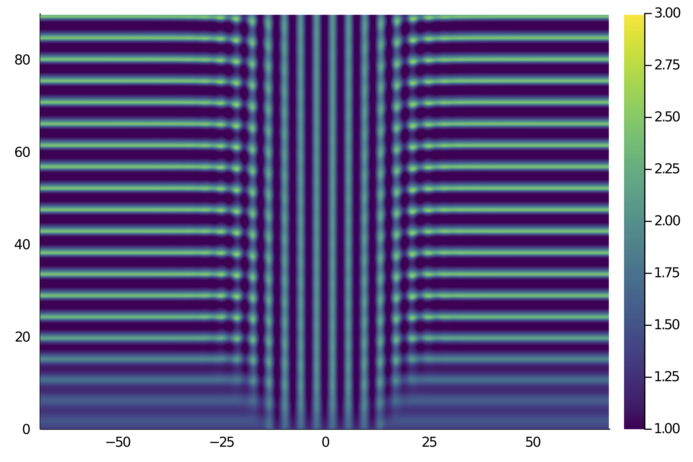
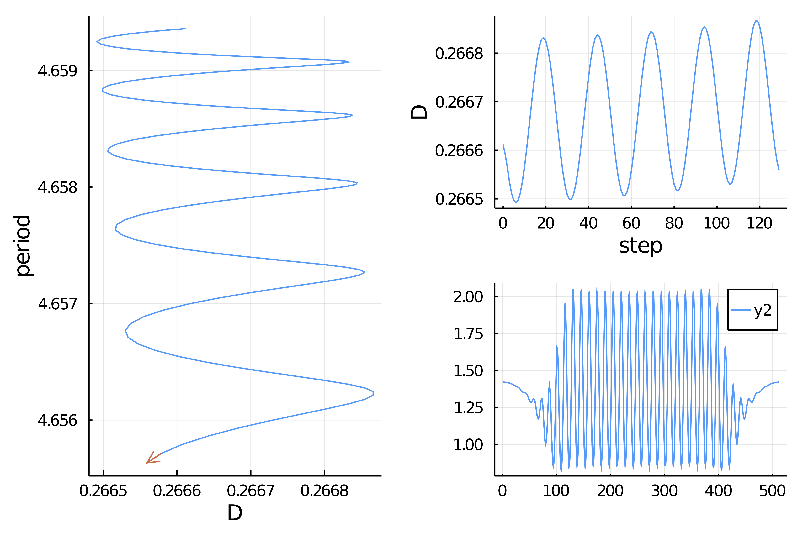

# Brusselator 1d with periodic BC (experienced user)

```@contents
Pages = ["BrusselatorFF.md"]
Depth = 3
```


!!! unknown "References"
    This example is taken from [^Tzou].

!!! info "Acknowledgment"
    The example was done in collaboration with Navid C. Constantinou.    

We look at the Brusselator in 1d. The equations are as follows

$$\begin{aligned} \frac { \partial u } { \partial t } & = D \frac { \partial ^ { 2 } u } { \partial z ^ { 2 } } + u ^ { 2 } v - ( B + 1 ) u + E \\ \frac { \partial v } { \partial t } & = \frac { \partial ^ { 2 } v} { \partial z ^ { 2 } } + B u - u ^ { 2 } v \end{aligned}\tag{E}$$

with periodic boundary conditions. These equations have been introduced to reproduce an oscillating chemical reaction.

We focus on computing a snaking branch of periodic orbits using spectral methods implemented in [Brusselator.jl](https://github.com/FourierFlows/Brusselator.jl):

```julia
using Revise, BifurcationKit
using Brusselator, Plots, Parameters, ForwardDiff, LinearAlgebra, Setfield, DiffEqBase
using FFTW: irfft
const BK = BifurcationKit

dev = CPU()					# Device (CPU/GPU)

nx      = 512				# grid resolution
stepper = "FilteredRK4"		# timestepper
dt  	= 0.01		# timestep
nsteps  = 9000		# total number of time-steps
nsubs	= 20		# number of time-steps for intermediate logging/plotting (nsteps must be multiple of nsubs)

# parameters for the model used by Tzou et al. (2013)
E = 1.4
L = 137.37				 # Domain length
ε = 0.1
μ = 25
ρ = 0.178

D_c = ((sqrt(1 + E^2) - 1) / E)^2
B_H = (1 + E * sqrt(D_c))^2

B = B_H + ε^2 * μ
D = D_c + ε^2 * ρ

kc = sqrt(E / sqrt(D))

# building the model
grid = OneDGrid(dev, nx, L)
params = Brusselator.Params(B, D, E)
vars = Brusselator.Vars(dev, grid)
equation = Brusselator.Equation(dev, params, grid)
prob = FourierFlows.Problem(equation, stepper, dt, grid, vars, params, dev)

get_u(prob) = irfft(prob.sol[:, 1], prob.grid.nx)
get_v(prob) = irfft(prob.sol[:, 2], prob.grid.nx)
u_solution = Diagnostic(get_u, prob; nsteps=nsteps+1)
diags = [u_solution]
```

We now integrate the model to find a periodic orbit:

```julia
l = 28
θ = @. (grid.x > -l/2) & (grid.x < l/2)

au, av = -(E^2 + kc^2) / B, -1
cu, cv = -E * (E + im) / B, 1

# initial condition
u0 = @.	  E + ε * real( au * exp(im * kc * grid.x) * θ + cu * (1 - θ) )
v0 = @. B/E + ε * real( av * exp(im * kc * grid.x) * θ + cv * (1 - θ) )
set_uv!(prob, u0, v0)

plot_output(prob)

# move forward in time to capture the periodic orbit
for j=0:Int(nsteps/nsubs)
	updatevars!(prob)
	stepforward!(prob, diags, nsubs)
end

# estimate of the periodic orbit, will be used as initial condition for a Krylov-Newton
initpo = copy(vcat(vcat(prob.vars.u, prob.vars.v), 4.9))

using RecursiveArrayTools

t = u_solution.t[1:10:nsteps]
U_xt = VectorOfArray([ u_solution.data[j] for j=1:10:nsteps ])
heatmap(grid.x, t, U_xt', c = :viridis, clims = (1, 3))
```

which gives




## Building the Shooting problem

We compute the periodic solution of (E) with a shooting algorithm.
We thus define a function to compute the flow and its differential.

```julia
# update the states
function _update!(out, pb::FourierFlows.Problem, N)
	out[1:N] .= pb.vars.u
	out[N+1:end] .= pb.vars.v
	out
end

# update the parameters in pb
function _setD!(D, pb::FourierFlows.Problem)
	pb.eqn.L[:, 1] .*= D / prob.params.D
	pb.params.D = D
end

# compute the flow from x up to time t
function ϕ(x, p, t)
	@unpack pb, D, N = p
	_setD!(D, pb)

	# set initial condition
	@views set_uv!(pb, x[1:N], x[N+1:2N])
	pb.clock.t=0.; pb.clock.step=0
	# determine number of time steps
	dt = pb.clock.dt
	nsteps = div(t, dt) |> Int
	# compute flow
	stepforward!(pb, nsteps)

	rest = t - nsteps * dt
	dt = pb.clock.dt
	pb.clock.dt = rest
	stepforward!(pb, 1)
	pb.clock.dt = dt
	updatevars!(pb)
	out = similar(x)
	_update!(out, pb, N)
	return out
end

# differential of the flow by FD
function dϕ(x, p, dx, t; δ = 1e-8)
		phi = ϕ(x, p, t)
		dphi = (ϕ(x .+ δ .* dx, p, t) .- phi) ./ δ
		return (t=t, u=phi, du=dphi)
end
```

We also need the vector field

```julia
function vf(x, p)
		@unpack pb, D, N = p
		# set parameter in prob
		pb.eqn.L[:, 1] .*= D / pb.params.D
		pb.params.D = D
		u = @view x[1:N]
		v = @view x[N+1:end]
		# set initial condition
		set_uv!(pb, u, v)
		rhs = Brusselator.get_righthandside(pb)
		# rhs is in Fourier space, put back to real space
		out = similar(x)
		ldiv!((@view out[1:N]), pb.grid.rfftplan, rhs[:, 1])
		ldiv!((@view out[N+1:end]), pb.grid.rfftplan, rhs[:, 2])
		return out
end
```

We then specify the shooting problem

```julia
# parameters to be passed to ϕ
par_bru = (pb = prob, N = nx, nsubs = nsubs, D = D)

# example of vector passed to ϕ
x0 = vcat(u0,v0)

# here we define the problem which encodes the standard shooting
flow = Flow(vf, ϕ, dϕ)

# the first section is centered around a stationary state
_center = vcat(E*ones(nx), B/E*ones(nx))

# section for the flow
sectionBru = BK.SectionSS(vf(initpo[1:end-1], par_bru), _center)
probSh = ShootingProblem(M = 1, flow = flow, ds = diff(LinRange(0, 1, 1 + 1)), section = sectionBru)
```

## Finding a periodic orbit

```julia
# linear solver for the Shooting problem
ls = GMRESIterativeSolvers(N = 2nx+1)

# parameters for Krylov-Newton
optn = NewtonPar(tol = 1e-9, verbose = true,
	# linear solver
	linsolver = ls,
	# eigen solver
	eigsolver = EigKrylovKit(dim = 30, x₀ = rand(2nx), verbose = 1  )
	)

# Newton-Krylov method to check convergence and tune parameters
solp, = @time newton(probSh, initpo, par_bru, optn,
	normN = x->norm(x,Inf))
```

and you should see (the guess was not that good)

```julia
Newton Iterations      f(x)      Linear Iterations

          0          1.6216e+03             0
          1          4.4373e+01             6
          2          9.0135e-01            15
          3          4.9086e-02            32
          4          4.1158e-03            27
          5          6.0755e-03            33
          6          2.4727e-04            33
          7          3.7843e-05            34
          8          1.9161e-07            31
          9          4.3243e-09            40
         10          2.3175e-13            27
 83.615047 seconds (284.31 M allocations: 24.250 GiB, 6.28% gc time)
```

## Computation of the snaking branch

```julia
# you can detect bifurcations with the option detectBifurcation = 3
optc = ContinuationPar(newtonOptions = optn, ds = -1e-3, dsmin = 1e-7, dsmax = 2e-3, pMax = 0.295, plotEveryStep = 2, maxSteps = 1000)
	bd, = continuation(probSh,
		solp, par_bru, (@lens _.D), optc;
		linearAlgo = MatrixFreeBLS(@set ls.N = 2nx+2),
		plot = true,
		verbosity = 3,
		plotSolution = (x,p ; kw...) -> plot!(x[1:nx];kw...),
		normC = x->norm(x,Inf))
```

which leads to




## Reference(s)
[^Tzou]:> Tzou, J. C., Y.-P. Ma, A. Bayliss, B. J. Matkowsky, and V. A. Volpert. **Homoclinic Snaking near a Codimension-Two Turing-Hopf Bifurcation Point in the Brusselator Model.**” Physical Review E 87, no. 2 (February 14, 2013): 022908. https://doi.org/10.1103/PhysRevE.87.022908.
