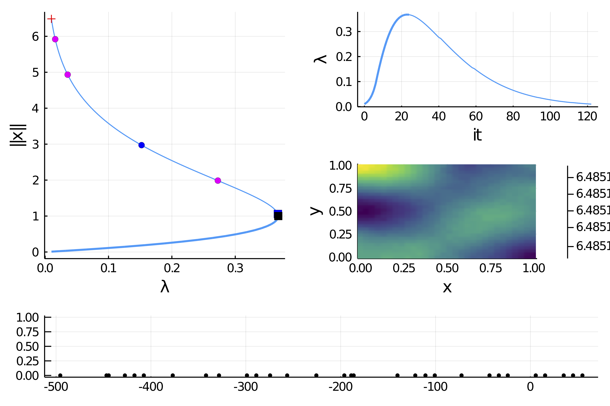
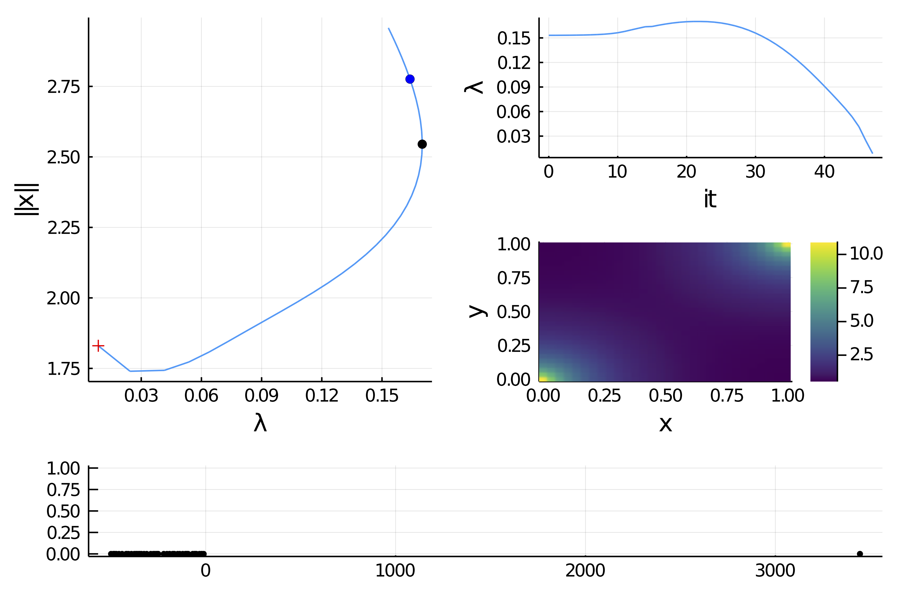
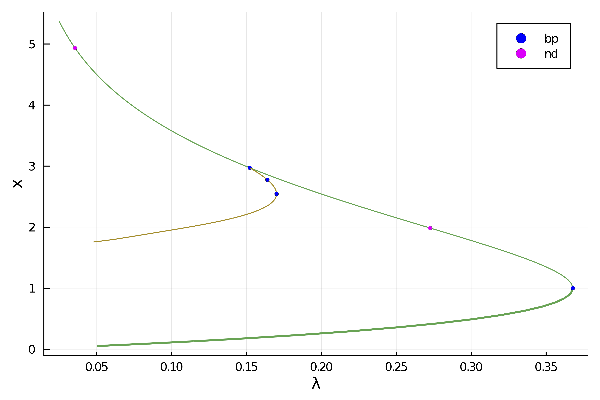
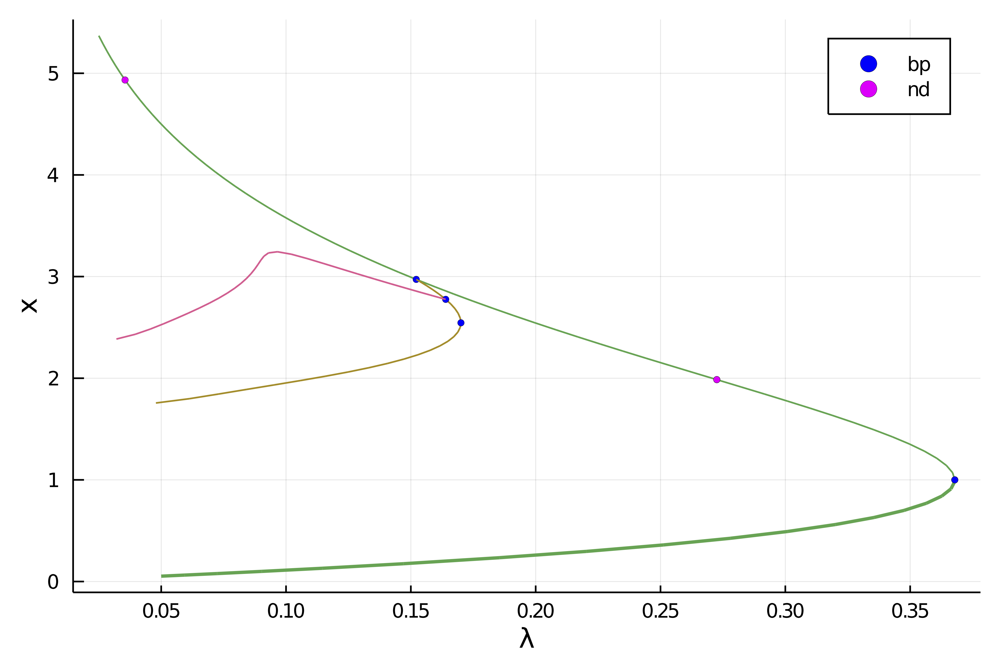
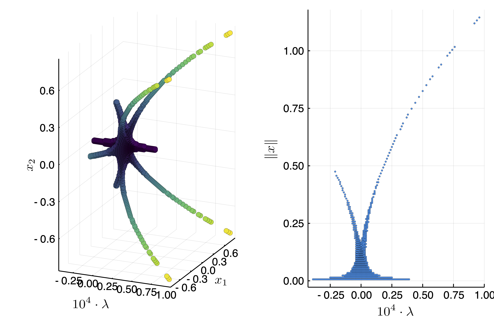
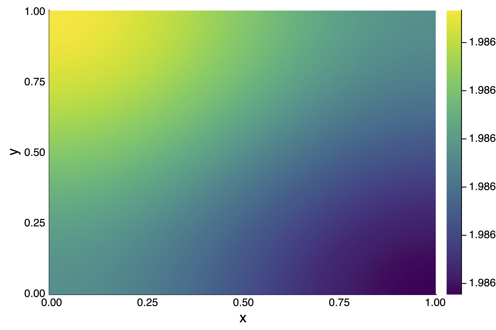
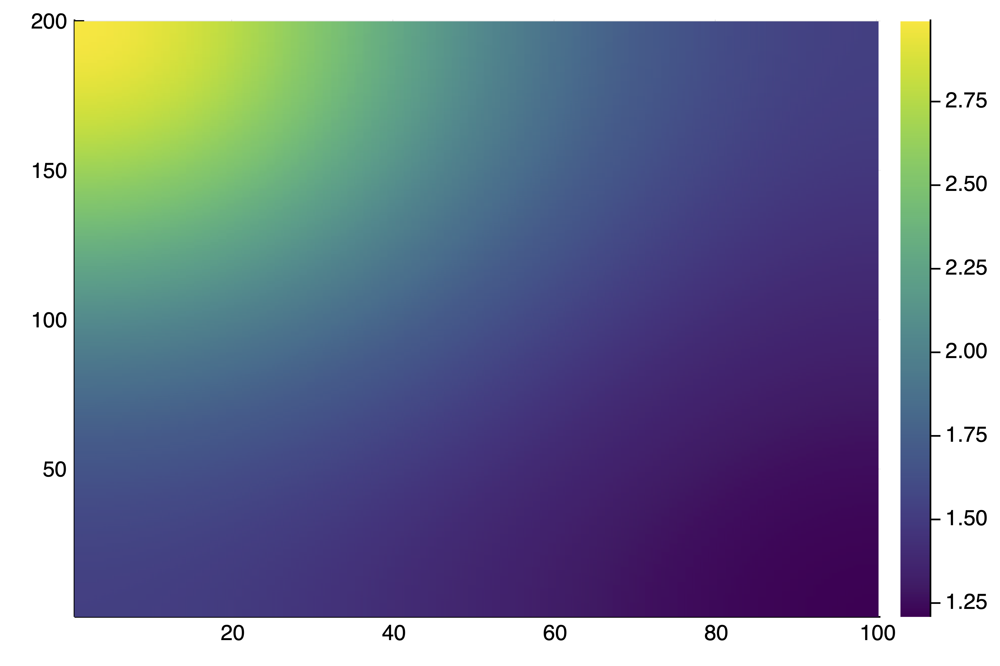
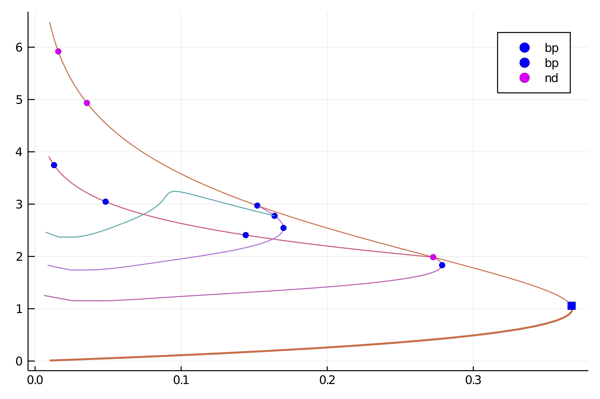

# A generalized Bratu–Gelfand problem in two dimensions

```@contents
Pages = ["mittelmann.md"]
Depth = 3
```

!!! unknown "References"
    The following example is exposed in Farrell, Patrick E., Casper H. L. Beentjes, and Ásgeir Birkisson. **The Computation of Disconnected Bifurcation Diagrams.** ArXiv:1603.00809 [Math], March 2, 2016.

        
We consider the problem of Mittelmann:

$$\Delta u +NL(\lambda,u) = 0$$

with Neumann boundary condition on $\Omega = (0,1)^2$ and where $NL(\lambda,u)\equiv-10(u-\lambda e^u)$. This is a good example to show how automatic branch switching works and also nonlinear deflation.

We start with some imports:

```julia
using Revise
using DiffEqOperators, ForwardDiff
using BifurcationKit, LinearAlgebra, Plots, SparseArrays, Parameters, Setfield
const BK = BifurcationKit

# define the sup norm
norminf = x -> norm(x, Inf)

# some plotting function to simplify our life
plotsol!(x, nx = Nx, ny = Ny; kwargs...) = heatmap!(reshape(x, nx, ny); color = :viridis, kwargs...)
plotsol(x, nx = Nx, ny = Ny; kwargs...) = (plot();plotsol!(x, nx, ny; kwargs...))
```
and with the discretization of the problem

```julia
function Laplacian2D(Nx, Ny, lx, ly, bc = :Neumann)
	hx = 2lx/Nx
	hy = 2ly/Ny
	D2x = CenteredDifference(2, 2, hx, Nx)
	D2y = CenteredDifference(2, 2, hy, Ny)

	Qx = Neumann0BC(hx)
	Qy = Neumann0BC(hy)

	D2xsp = sparse(D2x * Qx)[1]
	D2ysp = sparse(D2y * Qy)[1]
	A = kron(sparse(I, Ny, Ny), D2xsp) + kron(D2ysp, sparse(I, Nx, Nx))
	return A
end

ϕ(u, λ)  = -10(u-λ*exp(u))
dϕ(u, λ) = -10(1-λ*exp(u))

function NL!(dest, u, p)
	@unpack λ = p
	dest .= ϕ.(u, λ)
	return dest
end

NL(u, p) = NL!(similar(u), u, p)

function Fmit!(f, u, p)
	mul!(f, p.Δ, u)
	f .= f .+ NL(u, p)
	return f
end

Fmit(u, p) = Fmit!(similar(u), u, p)
```

It will also prove useful to have the jacobian of our functional: 

```julia
function JFmit(x,p)
	J = p.Δ
	dg = dϕ.(x, p.λ)
	return J + spdiagm(0 => dg)
end
```

We need to pass the parameters associated to this problem:

```julia
Nx = 200
Ny = 100
lx = 0.5
ly = 0.5

Δ = Laplacian2D(Nx, Ny, lx, ly)
par_mit = (λ = .05, Δ = Δ)

# initial guess f for newton
sol0 = zeros(Nx, Ny) |> vec
```

To compute the eigenvalues, we opt for the shift-invert strategy with shift `=0.5`

```julia
# eigensolver
eigls = EigArpack(0.5, :LM)

# options for Newton solver
opt_newton = BK.NewtonPar(tol = 1e-8, verbose = true, eigsolver = eigls, maxIter = 20)

# options for continuation
opts_br = ContinuationPar(dsmin = 0.001, dsmax = 0.05, ds = 0.01, pMax = 3.5, pMin = 0.025,
	detectBifurcation = 2, nev = 30, plotEveryNsteps = 10, newtonOptions = (@set opt_newton.verbose = true), 
	maxSteps = 100, precisionStability = 1e-6, nInversion = 4, dsminBisection = 1e-7, maxBisectionSteps = 25)
```	 
Note that we put the option `detectBifurcation = 2` to detect bifurcations precisely with a bisection method. Indeed, we need to locate these branch points precisely to be able to call automatic branch switching.

## Branch of homogenous solutions
At this stage, we note that the problem has a curve of homogenous (constant in space) solutions $u_h$ solving $N(\lambda, u_h)=0$. We shall compute this branch now.

We can now call `continuation` with the initial guess `sol0` which is homogenous, thereby generating homogenous solutions:

```julia
br, _ = @time BK.continuation(
	Fmit, JFmit,
	sol0, par_mit, (@lens _.λ), opts_br;
	printSolution = (x, p) -> norm(x),
	plotSolution = (x, p; kwargs...) -> plotsol!(x ; kwargs...),
	plot = true, verbosity = 3, normC = norminf)
```

You should see the following result:



Several branch point were detected as can be seen using the command

```julia
julia> br
Branch number of points: 85
Bifurcation points:
-   1,      bp point around p ≈ 0.36787944, step =  18, idx =  19, ind_bif =   1 [converged], δ = ( 1,  0)
-   2,      bp point around p ≈ 0.27243768, step =  33, idx =  34, ind_bif =   3 [converged], δ = ( 2,  0)
-   3,      bp point around p ≈ 0.15198538, step =  48, idx =  49, ind_bif =   4 [converged], δ = ( 1,  0)
-   4,      bp point around p ≈ 0.03515924, step =  76, idx =  77, ind_bif =   5 [converged], δ = ( 1,  0)
-   5,      bp point around p ≈ 0.03513245, step =  78, idx =  79, ind_bif =   6 [converged], δ = ( 1,  0)
Fold points:
-   1,    fold point around p ≈ 0.36787944, step =  19, idx =  19, ind_bif =   0 [    guess], δ = ( 0,  0)
```

We notice several simple bifurcation points for which the dimension of the kernel of the jacobian is one dimensional. In the above box, `δ = ( 1,  0)` gives the change in the stability. In this case, there is one vector in the kernel which is real. The bifurcation point 2 has a 2d kernel and is thus not amenable to automatic branch switching.

## Automatic branch switching 

To be able to perform branch switching, we need to pass the differentials of our functional. Using automatic differentiation, this is not a big deal:

```julia
D(f, x, p, dx) = ForwardDiff.derivative(t->f(x .+ t .* dx, p), 0.)

d1Fmit(x,p,dx1) = D((z, p0) -> Fmit(z, p0), x, p, dx1)
d2Fmit(x,p,dx1,dx2) = D((z, p0) -> d1Fmit(z, p0, dx1), x, p, dx2)
d3Fmit(x,p,dx1,dx2,dx3) = D((z, p0) -> d2Fmit(z, p0, dx1, dx2), x, p, dx3)
```

It is convenient to define the jet of `Fmit`

```julia
jet = (Fmit, JFmit, d2Fmit, d3Fmit)
```

We can now compute the branch off the third bifurcation point:

```julia
br1, _ = continuation(jet..., br, 3, 
	setproperties(opts_br;ds = 0.001, maxSteps = 40);
	verbosity = 3, plot = true,
	printSolution = (x, p) -> norm(x),
	plotSolution = (x, p; kwargs...) -> plotsol!(x ; kwargs...),
	normC = norminf)
```	

and you should see:



You can also plot the two branches together `plot([br,br1],plotfold=false)` and get



We continue our journey and compute the branch bifurcating of the first bifurcation point from the last branch we computed:

```julia
br2, _ = continuation(jet..., br1, 1, 
	setproperties(opts_br;ds = 0.001, maxSteps = 40); 	verbosity = 3, plot = true,
	printSolution = (x, p) -> norm(x),
	plotSolution = (x, p; kwargs...) -> plotsol!(x ; kwargs...), normC = norminf)
```



## Analysis at the 2d-branch points

The second bifurcation point on the branch `br` of homogenous solutions has a 2d kernel. We don't provide automatic branch switching but we provide two methods to deal with such case
- automatic local bifurcation diagram (see below)
- branch switching with deflation (see next section)

We provide a generic way to study branch points of arbitrary dimensions by computing a reduced equation. The general method is based on a Lyapunov-Schmidt reduction. We can compute the information about the branch point using the generic function (valid for simple branch points, Hopf bifurcation points,...)

```julia
bp2d = BK.computeNormalForm(jet..., br, 2;  verbose=true)
```

You can print the 2d reduced equation as follows. Note that this is a multivariate polynomials. For more information, see [Non-simple branch point](@ref).

```julia
julia> BK.nf(bp2d)
2-element Array{String,1}:
 " + (-73.897) * x1 ⋅ p + (-0.0012) ⋅ x1³ + (0.003) ⋅ x1 ⋅ x2²"
 " + (0.003) ⋅ x1² ⋅ x2 + (-73.897) * x2 ⋅ p + (-0.0012) ⋅ x2³"
```

You can evaluate this polynomial as follows `bp2d(Val(:reducedForm),[0.1,0.2], 0.01)` which returns a 2d vector or `bp2d([0.1,0.2], 0.01)`. This last expression actually returns a vector corresponding to the PDE problem.

You need to solve these equations to compute the bifurcation diagram in the neighborhood of the bifurcation point. In the present case, we do it using brute force. We suggest to use `IntervalConstraintProgramming.jl` for a more precise way.

```julia
using ProgressMeter
Nd = 200; L = 0.9
# sampling grid
X = LinRange(-L,L, Nd); Y = LinRange(-L,L, Nd); P = LinRange(-0.0001,0.0001, Nd+1)

# sample reduced equation on the grid for the first component
V1a = @showprogress [bp2d(Val(:reducedForm),[x1,y1], p1)[1] for p1 in P, x1 in X, y1 in Y]
Ind1 = findall( abs.(V1a) .<= 9e-4 * maximum(abs.(V1a)))
# intersect with second component
V2a = @showprogress [bp2d(Val(:reducedForm),[X[ii[2]],Y[ii[3]]], P[ii[1]])[2] for ii in Ind1]
Ind2 = findall( abs.(V2a) .<= 3e-3 * maximum(abs.(V2a)))

# get solutions
resp = Float64[]; resx = Vector{Float64}[]; resnrm = Float64[]
	@showprogress for k in Ind2
		ii = Ind1[k]
		push!(resp, P[ii[1]])
		push!(resnrm, sqrt(X[ii[2]]^2+Y[ii[3]]^2))
		push!(resx, [X[ii[2]], Y[ii[3]]])
	end
```

We can now plot the local bifurcation diagram as follows

```julia
plot(
	scatter(1e4resp, map(x->x[1], resx), map(x->x[2], resx); label = "", markerstrokewidth=0, xlabel = L"10^4 \cdot \lambda", ylabel = L"x_1", zlabel = L"x_2", zcolor = resnrm, color = :viridis,colorbar=false),
	scatter(1e4resp, resnrm; label = "", markersize =2, markerstrokewidth=0, xlabel = L"10^4 \cdot \lambda", ylabel = L"\|x\|"))
```


> This looks like a Pitchfork bifurcation with D4 symmetry

We can see that there are two types of solutions. After the bifurcation point, the solutions are of the form $(x_1,x_2) = (\pm x,\pm x)$ for some real $x$. Before the bifurcation point, the solutions are of the form $(x_1,x_2) = (\pm x,0), (0, \pm x)$ for some real $x$. Here is an example `plotsol(bp2d(resx[10], resp[10]))`



We could use the solutions saved in `resp, resx` as initial guesses for a call to `continuation` but we turn to a different method.

!!! tip "Solutions"
    The brute force method provided all solutions in a neighborhood of the bifurcation point.
    
    
!!! info "Advanced computation"
    Instead of using brute force and computing the vector field on a grid. One can rely on `IntervalConstraintProgramming.jl` to do better using bisection. See also this [discourse post](https://discourse.julialang.org/t/nd-level-sets/38532/13) where the same example is treated by D. P. Sanders.    

## Branch switching with deflated newton

At this stage, we know what happens at the 2d bifurcation point of the curve of homogenous solutions. We chose another method based on [Deflated problems](@ref). We want to find all nearby solutions of the problem close to this bifurcation point. This is readily done by trying several initial guesses in a brute force manner:

```julia

out = zeros(Nx*Ny)
# deflation operator to 
deflationOp = DeflationOperator(2.0, (x, y) -> dot(x, y), 1.0, [zeros(Nx*Ny)])

# options for the newton solver
optdef = setproperties(opt_newton; tol = 1e-8, maxIter = 100)

# eigen-elements close to the second bifurcation point on the branch
# of homogenous solutions
vp, ve, _, _= eigls(JFmit(out, @set par_mit.λ = br.bifpoint[2].param), 5)

for ii=1:size(ve, 2)
		outdef1, _, flag, _ = @time newton(
			Fmit, JFmit,
			# initial guess for newton
			br.bifpoint[2].x .+ 0.01 .* ve[:,ii] .* (1 .+ 0.01 .* rand(Nx*Ny)),
			(@set par_mit.λ = br.bifpoint[2].param + 0.005),
			optdef, deflationOp)
			flag && push!(deflationOp, outdef1)
	end
```

This provides `length(deflationOp) = 5` solutions as there are some symmetries in the problem. For example `plotsol(deflationOp[5])` gives



We can continue this solution as follows in one direction

```julia
brdef1, _ = @time BK.continuation(
	Fmit, JFmit,
	deflationOp[3], (@set par_mit.λ = br.bifpoint[2].param + 0.005), (@lens _.λ),
	setproperties(opts_br;ds = -0.001, detectBifurcation =2, dsmax = 0.01, maxSteps = 500);
	verbosity = 3, plot = true,
	printSolution = (x, p) -> norm(x),
	plotSolution = (x, p; kwargs...) -> plotsol!(x ; kwargs...), normC = norminf)
```

If we repeat the above loop but before the branch point by using `@set par_mit.λ = br.bifpoint[2].param + 0.005`, we get 3 new solutions that we can continue

```julia
brdef2, _ = @time BK.continuation(
	Fmit, JFmit,
	deflationOp[5], (@set par_mit.λ = br.bifpoint[2].param + 0.005), (@lens _.λ),
	setproperties(opts_br;ds = 0.001, detectBifurcation = 2, dsmax = 0.01);
	verbosity = 3, plot = true,
	printSolution = (x, p) -> norm(x),
	plotSolution = (x, p; kwargs...) -> plotsol!(x ; kwargs...), normC = norminf)
```	

thereby providing the following bifurcation diagram with `plot([br,br1,br2,brdef1, brdef2],plotfold=false, putbifptlegend = false)`

