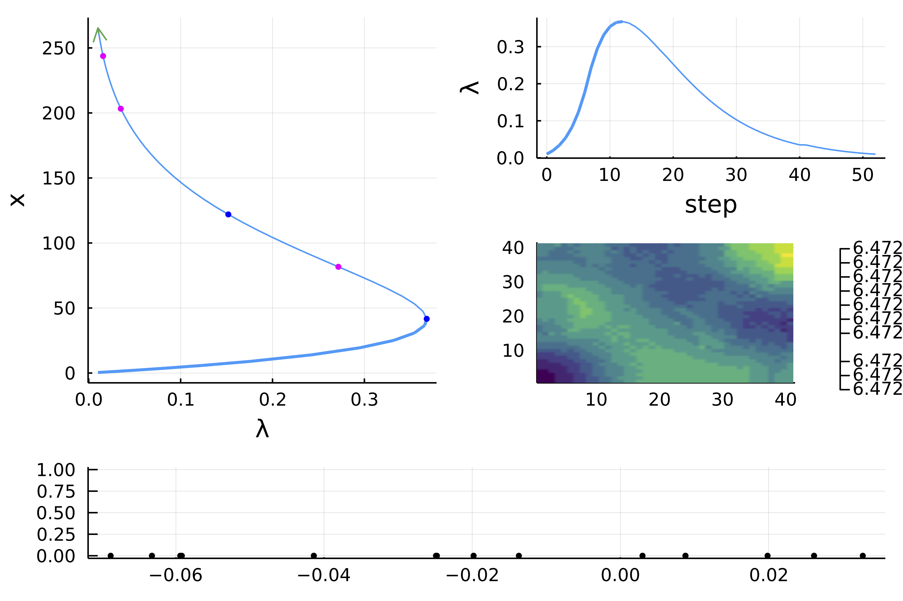
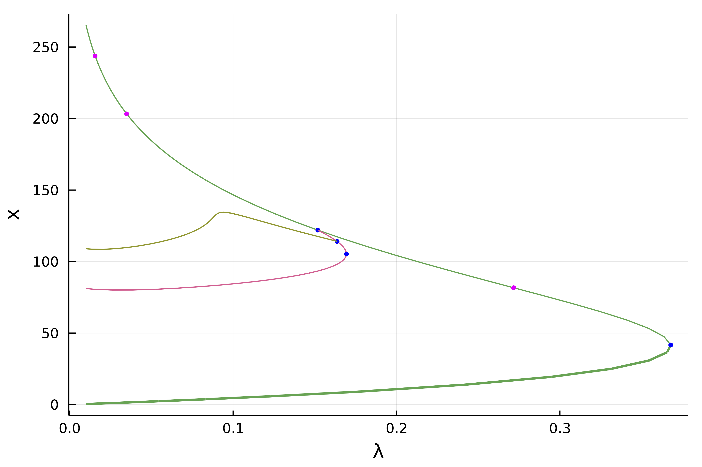
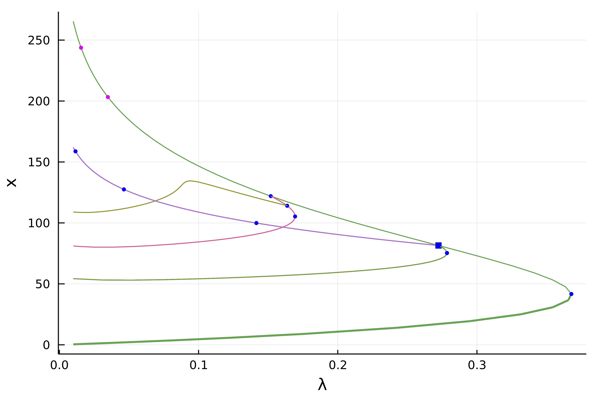

# 2d Bratu–Gelfand problem with [Gridap.jl](https://github.com/gridap/Gridap.jl) (Intermediate)

```@contents
Pages = ["mittelmannGridap.md"]
Depth = 3
```
        
We re-consider the problem of Mittelmann treated in the previous [tutorial](https://rveltz.github.io/BifurcationKit.jl/dev/mittelmannAuto/#Automatic-diagram-of-2d-Bratu–Gelfand-problem-(Intermediate)-1) but using a finite elements method (FEM) implemented in the package [Gridap.jl](https://github.com/gridap/Gridap.jl).

Recall that the problem is defined by solving

$$\Delta u +NL(\lambda,u) = 0$$

with Neumann boundary condition on $\Omega = (0,1)^2$ and where $NL(\lambda,u)\equiv-10(u-\lambda e^u)$. 

We start by installing the package [GridapBifurcationKit.jl](https://rveltz.github.io/GridapBifurcationKit.jl). Then, we can import the different packages:

```julia
using Revise
using Plots, Gridap,Setfield
using Gridap.FESpaces
using GridapBifurcationKit, BifurcationKit

# custom plot function to deal with Gridap
plotgridap!(x; k...) = (n=Int(sqrt(length(x)));heatmap!(reshape(x,n,n); color=:viridis, k...))
plotgridap(x; k...) =( plot();plotgridap!(x; k...))
```
We are now ready to specify the problem using the setting of **Gridap.jl**: it allows to write the equations very closely to the mathematical formulation:

```julia
@law NL(u) = exp(u)

# residual 
res(u,p,v) = -∇(v)⋅∇(u) -  v ⋅ (u - p.λ * NL(u)) * 10

# jacobian of the residual
jac(u,p,du,v) = -∇(v)⋅∇(du) - v ⋅ du ⋅ (1 - p.λ * NL(u)) * 10

# 3rd and 4th derivatives, used for aBS
d2res(u,p,du1,du2,v) = v ⋅ du1 ⋅ du2 ⋅ NL(u) * 10 * p.λ
d3res(u,p,du1,du2,du3,v) = v ⋅ du1 ⋅ du2 ⋅ du3 ⋅ NL(u) * 10 * p.λ

# discretisation
n = 40
domain = (0,1,0,1)
cells = (n,n)
model = CartesianDiscreteModel(domain,cells)

# function spaces
order = 1
V = TestFESpace(
	model=model,reffe=:Lagrangian,valuetype=Float64,
	order=order,conformity=:H1,)#dirichlet_tags="boundary")
U = TrialFESpace(V)

trian = Triangulation(model)
degree = 2*order
quad = CellQuadrature(trian,degree)

# example of initial guess
uh = zero(U)

# model parameter
par_bratu = (λ = 0.01,)

# problem definition
prob = GridapProblem(res, jac, d2res, d3res, trian, quad, V, U)
```

We can call then the newton solver:

```julia
optn = NewtonPar(eigsolver = EigArpack())
sol, = newton(prob, uh, par_bratu, NewtonPar(optn; verbose = true))
```	

which gives

```julia
 Newton Iterations 
   Iterations      Func-count      f(x)      Linear-Iterations

        0                1     2.4687e-03         0
        1                2     1.2637e-07         1
        2                3     3.3579e-16         1
```

In the same vein, we can continue this solution as function of $\lambda$:

```julia
opts = ContinuationPar(pMax = 40., pMin = 0.01, ds = 0.01, maxSteps = 1000, detectBifurcation = 3, newtonOptions = optn, nev = 20)
br, = continuation(prob, uh, par_bratu, (@lens _.λ), opts;
	plot = true, verbosity = 2,
	plotSolution = (x,p;k...) -> plotgridap!(x;  k...))
```

We obtain:

```julia
julia> br
 Branch number of points: 53
Branch of Equilibrium
Bifurcation points:
 (ind_ev = index of the bifurcating eigenvalue e.g. `br.eig[idx].eigenvals[ind_ev]`)
- #  1,      bp at p ≈  0.36782970 ± 5e-05, step =  12, eigenelements in eig[ 13], ind_ev =   1 [converged], δ = ( 1,  0)
- #  2,      nd at p ≈  0.27168226 ± 1e-03, step =  19, eigenelements in eig[ 20], ind_ev =   3 [converged], δ = ( 2,  0)
- #  3,      bp at p ≈  0.15185425 ± 3e-06, step =  26, eigenelements in eig[ 27], ind_ev =   4 [converged], δ = ( 1,  0)
- #  4,      nd at p ≈  0.03484591 ± 6e-05, step =  41, eigenelements in eig[ 42], ind_ev =   6 [converged], δ = ( 2,  0)
- #  5,      nd at p ≈  0.01556521 ± 3e-05, step =  48, eigenelements in eig[ 49], ind_ev =   8 [converged], δ = ( 2,  0)
Fold points:
- #  1,    fold at p ≈  0.36782970, step =  13, eigenelements in eig[ 13], ind_ev =   0 [    guess], δ = ( 0,  0)
```




## Computation of the first branches

Let us now compute the first branches from the bifurcation points. We start with the one with 1d kernel:

```julia
br1, = continuation(prob, br, 3,
	setproperties(opts;ds = 0.001, dsmax = 0.05, maxSteps = 140, detectBifurcation = 3);
	verbosity = 0, plot = true, nev = 10,
	tangentAlgo = BorderedPred(),
	usedeflation = true,
	plotSolution = (x, p; k...) -> plotgridap!(x;  k...))
```

We also compute the branch from the first bifurcation point on this branch `br1`:

```julia
br2, = continuation(prob, br1, 3,
	setproperties(opts;ds = 0.005, dsmax = 0.05, maxSteps = 140, detectBifurcation = 0);
	verbosity = 0, plot = true, nev = 10,
	tangentAlgo = BorderedPred(),
	usedeflation = true,
	plotSolution = (x, p; k...) -> plotgridap!(x;  k...))

plot([br,br1,br2])
```

We get:



Finally, we compute the branches from the 2d bifurcation point:

```julia
br3, = continuation(prob, br, 2,
	setproperties(opts;ds = 0.005, dsmax = 0.05, maxSteps = 140, detectBifurcation = 3);
	verbosity = 0, plot = true, nev = 10,
	usedeflation = true,
	plotSolution = (x, p; k...) -> plotgridap!(x;  k...))

plot([br,br1,br2,br3...])
```

