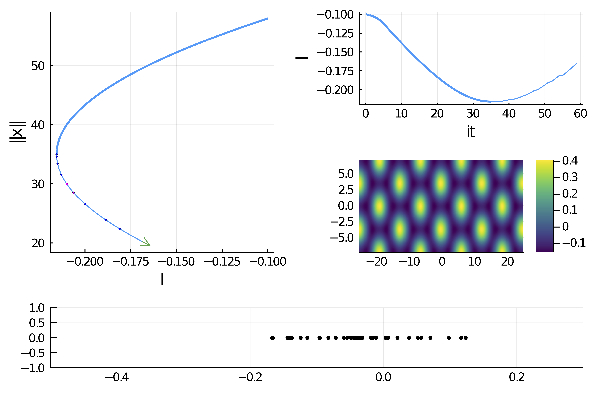
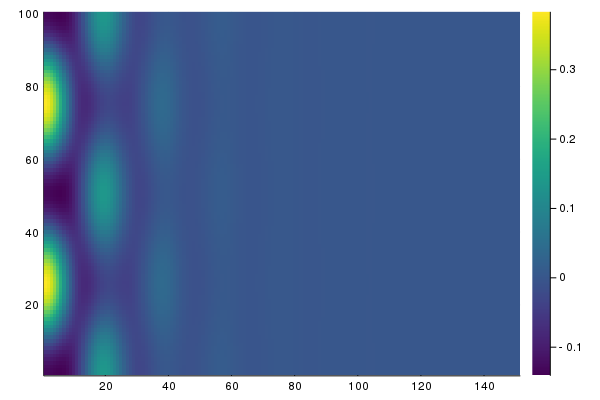
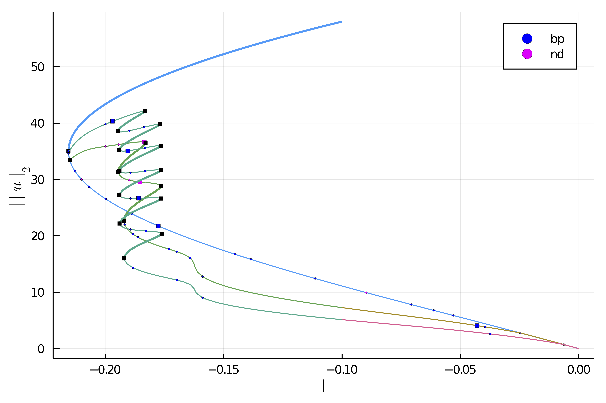
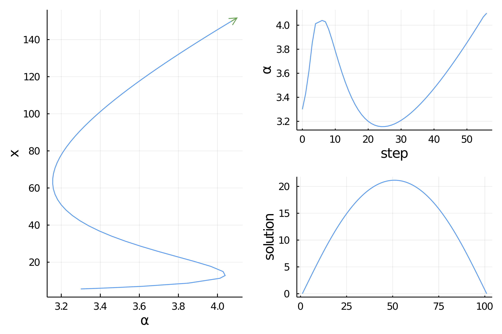
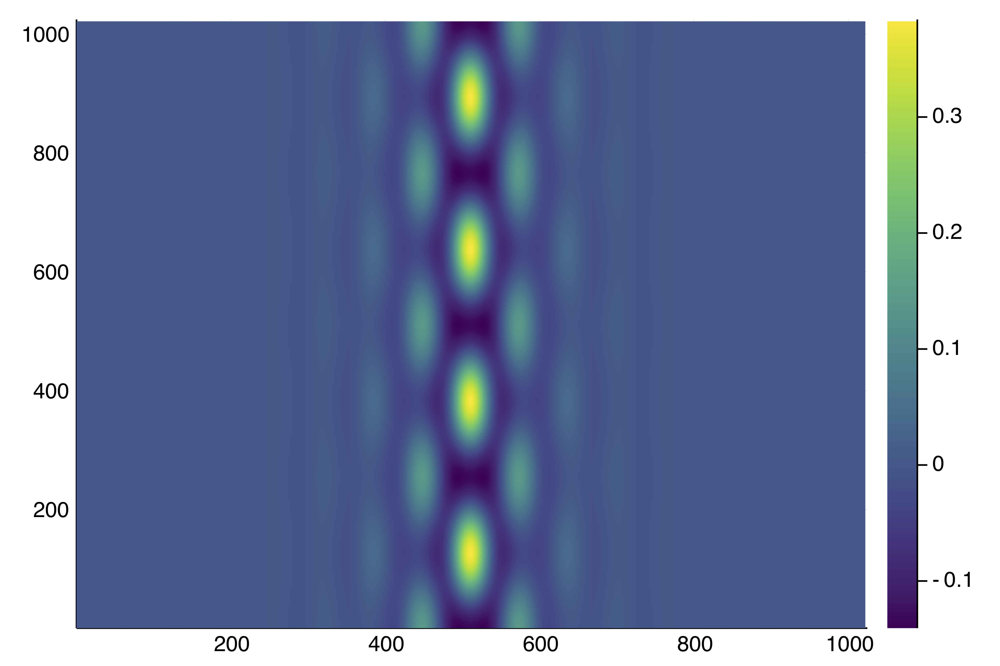
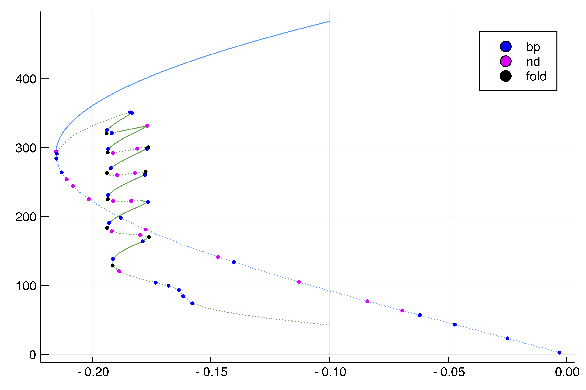

# Tutorials

## Example 1: nonlinear pendulum

This is a simple example in which we aim at solving $\Delta\theta+\alpha f(\theta,\beta)=0$ with boundary conditions $\theta(0) = \theta(1)=0$. This example is coded in `examples/chan.jl` ; it is a basic example from the Trilinos library. We start with some imports:

```julia
using PseudoArcLengthContinuation, LinearAlgebra, Plots
const Cont = PseudoArcLengthContinuation

source_term(x; a = 0.5, b = 0.01) = 1 + (x + a*x^2)/(1 + b*x^2)
dsource_term(x; a = 0.5, b = 0.01) = (1-b*x^2+2*a*x)/(1+b*x^2)^2
```

We then write our functional:

```julia
function F_chan(x, α, β = 0.)
	f = similar(x)
	n = length(x)
	f[1] = x[1] - β
	f[n] = x[n] - β
	for i=2:n-1
		f[i] = (x[i-1] - 2 * x[i] + x[i+1]) * (n-1)^2 + α * source_term(x[i], b = β)
	end
	return f
end
```
We want to call a Newton solver. We first need an initial guess:

```julia
n = 101
sol = [(i-1)*(n-i)/n^2+0.1 for i=1:n]
```
and parameters

```julia
a = 3.3
```
Finally, we need to provide some parameters for the Newton iterations. This is done by calling

```julia
opt_newton = Cont.NewtonPar(tol = 1e-11, verbose = true)
```

We call the Newton solver:

```julia
out, hist, flag = @time Cont.newton(
		x -> F_chan(x, a, 0.01),
		sol,
		opt_newton)
```
and you should see

```
Newton Iterations
   Iterations      Func-count      f(x)      Linear-Iterations

        0                1     2.3440e+01         0
        1                2     1.3774e+00         1
        2                3     1.6267e-02         1
        3                4     2.4521e-06         1
        4                5     5.9356e-11         1
        5                6     5.8117e-12         1
  0.102035 seconds (119.04 k allocations: 7.815 MiB)
```

Note that, in this case, we did not give the Jacobian. It was computed internally using Finite Differences. We can now perform numerical continuation wrt the parameter `a`. Again, we need to provide some parameters for the continuation:

```julia
opts_br0 = Cont.ContinuationPar(dsmin = 0.01, dsmax = 0.15, ds= 0.01, pMax = 4.1)
	opts_br0.detect_fold = true
	# options for the newton solver
	opts_br0.newtonOptions.maxIter = 20
	opts_br0.newtonOptions.tol = 1e-8
	opts_br0.maxSteps = 150
```

Then, we can call the continuation routine

```julia
br, u1 = Cont.continuation((x,p) -> F_chan(x,p, 0.01),
	out, a,
	opts_br0,
	printsolution = x -> norm(x,Inf64),
	plot = true,
	plotsolution = (x;kwargs...) -> (plot!(x,subplot=4,ylabel="solution",label="")))
```
and you should see


The top left figure is the norm of the solution as function of the parameter `a`, it can be changed by passing a different `printsolution` to `continuation`. The bottom left figure is the norm of the solution as function of iteration number. The bottom right is the solution for the current value of the parameter.
	
!!! note "Bif. point detection"
    Two Fold points were detected. This can be seen by looking at `br.bifpoint` or by the black 	dots on the continuation plots.


### Continuation of Fold points
We can also take the first Fold point and create an initial guess to locate it precisely. However, this only works when the jacobian is computed precisely:

```julia
function Jac_mat(u, α, β = 0.)
	n = length(u)
	J = zeros(n, n)
	J[1, 1] = 1.0
	J[n, n] = 1.0
	for i = 2:n-1
		J[i, i-1] = (n-1)^2
		J[i, i+1] = (n-1)^2
    	J[i, i] = -2 * (n-1)^2 + α * dsource_term(u[i], b = β)
	end
	return J
end

# index of the Fold in br.bifpoint
indfold = 2

outfold, hist, flag = @time Cont.newtonFold((x,α) -> F_chan(x, α, 0.01),
				(x, α) -> Jac_mat(x, α, 0.01),
				br, indfold, #index of the fold point
				opts_br0.newtonOptions)
		flag && printstyled(color=:red, "--> We found a Fold Point at α = ", outfold.p, ", β = 0.01, from ", br.bifpoint[indfold][3],"\n")
```

which gives

```julia
  0.085458 seconds (98.05 k allocations: 40.414 MiB, 21.55% gc time)
--> We found a Fold Point at α = 3.1556507316107947, β = 0.01, from 3.155651011218501
```

We can also continue this fold point in the plane $(a,b)$ performing a Fold Point Continuation. In the present case, we find a Cusp point.

```julia
optcontfold = ContinuationPar(dsmin = 0.001, dsmax = 0.05,ds= 0.01, pMax = 4.1, pMin = 0.)
	optcontfold.newtonOptions.tol = 1e-8
	outfoldco, hist, flag = @time Cont.continuationFold(
		(x, α, β) ->  F_chan(x, α, β),
		(x, α, β) -> Jac_mat(x, α, β),
		br, indfold,
		0.01,
		optcontfold)

Cont.plotBranch(outfoldco;xlabel="b",ylabel="a")
```

This produces:


### Using GMRES or another linear solver

We continue the previous example but now using Matrix Free methods. The user can pass its own solver by implementing a version of `LinearSolver`. Some basic linear solvers have been implemented from `KrylovKit.jl` and `IterativeSolvers.jl`, we can use them here. Note that we can implement preconditioners with this. The same functionality is present for the eigensolver.

```julia
# very easy to write since we have F_chan. We could use Automatic Differentiation as well
function dF_chan(x, dx, α, β = 0.)
	out = similar(x)
	n = length(x)
	out[1] = dx[1]
	out[n] = dx[n]
	for i=2:n-1
		out[i] = (dx[i-1] - 2 * dx[i] + dx[i+1]) * (n-1)^2 + α * dsource_term(x[i], b = β) * dx[i]
	end
	return out
end

# we create a new linear solver
ls = Cont.GMRES_KrylovKit{Float64}(dim = 100)
# and pass it to the newton parameters
opt_newton_mf = Cont.NewtonPar(tol = 1e-11, verbose = true, linsolver = ls, eigsolver = Default_eig())
# we can then call the newton solver
out_mf, hist, flag = @time Cont.newton(
	x -> F_chan(x, a, 0.01),
	x -> (dx -> dF_chan(x, dx, a, 0.01)),
	sol,
	opt_newton_mf)
```

which gives:

```julia
Newton Iterations
   Iterations      Func-count      f(x)      Linear-Iterations

        0                1     2.3440e+01         0
        1                2     1.3774e+00        68
        2                3     1.6267e-02        98
        3                4     2.4336e-06        73
        4                5     6.2617e-12        73
  0.336398 seconds (1.15 M allocations: 54.539 MiB, 7.93% gc time)
```

We can speed-up this computation, *i.e.* reduce the number of `Linear-Iterations`, by using a preconditioner

```julia
P = spdiagm(0 => -2 * (n-1)^2 * ones(n), -1 => (n-1)^2 * ones(n-1), 1 => (n-1)^2 * ones(n-1))
P[1,1:2] .= [1, 0.];P[end,end-1:end] .= [0, 1.]	

ls = GMRES_IterativeSolvers(tol = 1e-4, N = length(sol), restart = 10, maxiter=10, Pl = lu(P))	
	opt_newton_mf = Cont.NewtonPar(tol = 1e-11, verbose = true, linsolver = ls, eigsolver = DefaultEig())
	out_mf, hist, flag = @time Cont.newton(
		x -> F_chan(x, a, 0.01),
		x -> (dx -> dF_chan(x, dx, a, 0.01)),
		sol,
		opt_newton_mf)
```

which gives

```julia
 Newton Iterations 
   Iterations      Func-count      f(x)      Linear-Iterations

        0                1     2.3440e+01         0
        1                2     1.3777e+00         3
        2                3     1.6266e-02         3
        3                4     2.3699e-05         2
        4                5     4.8930e-09         3
        5                6     6.3288e-12         4
```

## Example 2: Snaking with 2d Swift-Hohenberg equation
We study the following PDE 

$$0=-(I+\Delta)^2 u+l\cdot u +\nu u^2-u^3$$ 

with periodic boundary conditions. This example is in the file `example/SH2d-fronts.jl`. It is extracted from [pde2path](http://www.staff.uni-oldenburg.de/hannes.uecker/pde2path/). We use a Sparse Matrix to express the operator $L_1=(I+\Delta)^2$

```julia
using DiffEqOperators
using PseudoArcLengthContinuation, LinearAlgebra, Plots, SparseArrays
const Cont = PseudoArcLengthContinuation

heatmapsol(x) = heatmap(reshape(x,Nx,Ny)',color=:viridis)

Nx = 151
Ny = 100
lx = 4*2pi
ly = 2*2pi/sqrt(3)

function Laplacian2D(Nx, Ny, lx, ly, bc = :Neumann)
	hx = 2lx/Nx
	hy = 2ly/Ny
	D2x = CenteredDifference(2, 2, hx, Nx)
	D2y = CenteredDifference(2, 2, hy, Ny)
	if bc == :Neumann
		Qx = Neumann0BC(hx)
		Qy = Neumann0BC(hy)
	end
	A = kron(sparse(I, Ny, Ny), sparse(D2x * Qx)[1]) + kron(sparse(D2y * Qy)[1], sparse(I, Nx, Nx))
	return A, D2x
end


Δ = Laplacian2D(Nx,Ny,lx,ly)
const L1 = (I + Δ)^2
```
We also write the functional and its differential which is a Sparse Matrix

```julia
function F_sh(u, l=-0.15, ν=1.3)
	return -L1 * u .+ (l .* u .+ ν .* u.^2 .- u.^3)
end

function dF_sh(u, l=-0.15, ν=1.3)
	return -L1 + spdiagm(0 => l .+ 2ν .* u .- 3u.^2)
end
```

We first look for hexagonal patterns. This is done with

```julia
X = -lx .+ 2lx/(Nx) * collect(0:Nx-1)
Y = -ly .+ 2ly/(Ny) * collect(0:Ny-1)

sol0 = [(cos(x) + cos(x/2) * cos(sqrt(3) * y/2) ) for x in X, y in Y]
		sol0 .= sol0 .- minimum(vec(sol0))
		sol0 ./= maximum(vec(sol0))
		sol0 = sol0 .- 0.25
		sol0 .*= 1.7
		heatmap(sol0',color=:viridis)

opt_new = Cont.NewtonPar(verbose = true, tol = 1e-9, maxIter = 100)
	sol_hexa, hist, flag = @time Cont.newton(
				x -> F_sh(x,-.1,1.3),
				u -> dF_sh(u,-.1,1.3),
				vec(sol0),
				opt_new)
	println("--> norm(sol) = ",norm(sol_hexa,Inf64))
	heatmapsol(sol_hexa)
```
which produces the results

```julia
Newton Iterations 
   Iterations      Func-count      f(x)      Linear-Iterations
        0                1     7.7310e+02         0
        1                2     7.3084e+03         1
        2                3     2.1595e+03         1
        3                4     1.4173e+04         1
        4                5     4.1951e+03         1
        5                6     1.2394e+03         1
        6                7     3.6414e+02         1
        7                8     1.0659e+02         1
        8                9     3.1291e+01         1
        9               10     1.3202e+01         1
       10               11     2.6793e+00         1
       11               12     3.2728e-01         1
       12               13     1.2491e-02         1
       13               14     2.7447e-05         1
       14               15     2.2626e-10         1
  1.413734 seconds (45.47 k allocations: 749.631 MiB, 3.60% gc time)
```
  
with


We can now continue this solution

```julia
opts_cont = ContinuationPar(dsmin = 0.001, dsmax = 0.015,ds= -0.0051, pMax = 0.2, pMin = -1.0, save = false, theta = 0.1, plot_every_n_steps = 3, newtonOptions = opt_new)
	opts_cont.detect_fold = true
	opts_cont.maxSteps = 340

	br, u1 = @time Cont.continuation(
		(x,p) -> F_sh(x,p,1.3),
		(x,p) -> dF_sh(x,p,1.3),
		sol_hexa,0.099,opts_cont,plot = true,
		plotsolution = (x;kwargs...)->(heatmap!(X, Y, reshape(x, Nx, Ny)', color=:viridis, subplot=4, label="")),
		printsolution = x -> norm(x,Inf64))
```
with result:



### Snaking computed with deflation

We know that there is snaking near the left fold. Let us look for other solutions like fronts. The problem is that if the guess is not precise enough, the newton iterations will converge to the solution with hexagons `sol_hexa`. We appeal to the technique initiated by P. Farrell and use a **deflated problem**. More precisely, we apply the newton iterations to the following functional $$u\to\left(\frac{1}{\|u-sol_{hexa}\|^2}+\sigma\right)F_{sh}(u)$$
which penalizes `sol_hexa`.

```julia
deflationOp = DeflationOperator(2.0,(x,y) -> dot(x,y),1.0,[sol_hexa])
opt_new.maxIter = 250
outdef, _,flag,_ = @time Cont.newtonDeflated(
				x -> F_sh(x,-.1,1.3),
				u -> dF_sh(u,-.1,1.3),
				0.2vec(sol_hexa) .* vec([exp.(-(x+lx)^2/25) for x in X, y in Y]),
				opt_new,deflationOp, normN = x -> norm(x,Inf64))
		heatmapsol(outdef) |> display
		flag && push!(deflationOp, outdef)
```
which gives:



Note that `push!(deflationOp, outdef)` deflates the newly found solution so that by repeating the process we find another one:

```julia
outdef, _,flag,_ = @time Cont.newtonDeflated(
				x -> F_sh(x,-.1,1.3),
				u -> dF_sh(u,-.1,1.3),
				0.2vec(sol_hexa) .* vec([exp.(-(x)^2/25) for x in X, y in Y]),
				opt_new,deflationOp, normN = x -> norm(x,Inf64))
		heatmapsol(outdef) |> display
		flag && push!(deflationOp, outdef)
```


Again, repeating this from random guesses, we find several more solutions, like for example


We can now continue the solutions located in `deflationOp.roots`

```julia
opts_cont = ContinuationPar(dsmin = 0.001, dsmax = 0.005,ds= -0.0015, pMax = -0.01, pMin = -1.0, theta = 0.5, plot_every_n_steps = 3, newtonOptions = opt_new, a = 0.5, detect_fold = true)
	opts_cont.newtonOptions.tol = 1e-9
	opts_cont.newtonOptions.maxIter = 50
	opts_cont.maxSteps = 450

	br, u1 = @time Cont.continuation(
		(x,p) -> F_sh(x,p,1.3), (x,p) -> dF_sh(x,p,1.3),
		deflationOp.roots[5],
		-0.1,
		opts_cont,plot = true,
		plotsolution = (x;kwargs...)->(heatmap!(X,Y,reshape(x,Nx,Ny)',color=:viridis,subplot=4,label="")),
		printsolution = x->norm(x))
```

and get using `Cont.plotBranch(br)`, we obtain:



Note that the plot provides the stability of solutions and bifurcation points. We did not presented how to do this by simplicity. Interested readers should consult the associated file `example/SH2d-fronts.jl` in the `example` folder. 

## Example 3: Brusselator in 1d

We look at the Brusselator in 1d. The equations are as follows

$$\begin{aligned} \frac { \partial X } { \partial t } & = \frac { D _ { 1 } } { l ^ { 2 } } \frac { \partial ^ { 2 } X } { \partial z ^ { 2 } } + X ^ { 2 } Y - ( β + 1 ) X + α \\ \frac { \partial Y } { \partial t } & = \frac { D _ { 2 } } { l ^ { 2 } } \frac { \partial ^ { 2 } Y } { \partial z ^ { 2 } } + β X - X ^ { 2 } Y \end{aligned}$$

with Dirichlet boundary conditions

$$\begin{array} { l } { X ( t , z = 0 ) = X ( t , z = 1 ) = α } \\ { Y ( t , z = 0 ) = Y ( t , z = 1 ) = β / α } \end{array}$$

These equations have been derived to reproduce an oscillating chemical reaction. There is an obvious equilibrium $(α, β / α)$. Here, we consider bifurcation with respect to the parameter $l$.

We start by writing the functional

```julia
using PseudoArcLengthContinuation, LinearAlgebra, Plots, SparseArrays
const Cont = PseudoArcLengthContinuation

f1(u, v) = u^2*v

function F_bru(x, α, β; D1 = 0.008, D2 = 0.004, l = 1.0)
	n = div(length(x), 2)
	h = 1.0 / (n+1); h2 = h*h

	u = @view x[1:n]
	v = @view x[n+1:2n]

	# output
	f = similar(x)

	f[1] = u[1] - α
	f[n] = u[n] - α
	for i=2:n-1
		f[i] = D1/l^2 * (u[i-1] - 2u[i] + u[i+1]) / h2 - (β + 1) * u[i] + α + f1(u[i], v[i])
	end


	f[n+1] = v[1] - β / α
	f[end] = v[n] - β / α;
	for i=2:n-1
		f[n+i] = D2/l^2 * (v[i-1] - 2v[i] + v[i+1]) / h2 + β * u[i] - f1(u[i], v[i])
	end

	return f
end
```

For computing periodic orbits, we will need a Sparse representation of the Jacobian:

```julia
function Jac_sp(x, α, β; D1 = 0.008, D2 = 0.004, l = 1.0)
	# compute the Jacobian using a sparse representation
	n = div(length(x), 2)
	h = 1.0 / (n+1); hh = h*h

	diag  = zeros(2n)
	diagp1 = zeros(2n-1)
	diagm1 = zeros(2n-1)

	diagpn = zeros(n)
	diagmn = zeros(n)

	diag[1] = 1.0
	diag[n] = 1.0
	diag[n + 1] = 1.0
	diag[end] = 1.0

	for i=2:n-1
		diagm1[i-1] = D1 / hh/l^2
		diag[i]   = -2D1 / hh/l^2 - (β + 1) + 2x[i] * x[i+n]
		diagp1[i] = D1 / hh/l^2
		diagpn[i] = x[i]^2
	end

	for i=n+2:2n-1
		diagmn[i-n] = β - 2x[i-n] * x[i]
		diagm1[i-1] = D2 / hh/l^2
		diag[i]   = -2D2 / hh/l^2 - x[i-n]^2
		diagp1[i] = D2 / hh/l^2
	end
	return spdiagm(0 => diag, 1 => diagp1, -1 => diagm1, n => diagpn, -n => diagmn)
end
```

Finally, to monitor if the solution is constant in space, we will use the following callback

```julia
function finalise_solution(z, tau, step, contResult)
	n = div(length(z.u), 2)
	printstyled(color=:red, "--> Solution constant = ", norm(diff(z.u[1:n])), " - ", norm(diff(z.u[n+1:2n])), "\n")
	return true
end
```

We can now compute to equilibrium and its stability

```julia
n = 301

a = 2.
b = 5.45

sol0 = vcat(a * ones(n), b/a * ones(n))

opt_newton = Cont.NewtonPar(tol = 1e-11, verbose = true, eigsolver = eig_KrylovKit(tol=1e-6, dim = 60))
	out, hist, flag = @time Cont.newton(
		x -> F_bru(x, a, b),
		x -> Jac_sp(x, a, b),
		sol0,
		opt_newton)
		
opts_br0 = ContinuationPar(dsmin = 0.001, dsmax = 0.0061, ds= 0.0051, pMax = 1.8, save = false, theta = 0.01, detect_fold = true, detect_bifurcation = true, nev = 41, plot_every_n_steps = 50, newtonOptions = opt_newton)
	opts_br0.newtonOptions.maxIter = 20
	opts_br0.newtonOptions.tol = 1e-8
	opts_br0.maxSteps = 280

	br, u1 = @time Cont.continuation(
		(x, p) ->   F_bru(x, a, b, l = p),
		(x, p) -> Jac_sp(x, a, b, l = p),
		out,
		0.3,
		opts_br0,
		plot = true,
		plotsolution = (x;kwargs...)->(N = div(length(x), 2);plot!(x[1:N], subplot=4, label="");plot!(x[N+1:2N], subplot=4, label="")),
		finaliseSolution = finalise_solution,
		printsolution = x -> norm(x, Inf64))		
```

We obtain the following bifurcation diagram with 3 Hopf bifurcation points


### Continuation of Hopf points

We use the bifurcation points guesses located in `br.bifpoint` to turn them into precise bifurcation points. For the first one, we have

```julia
# index of the Hopf point in br.bifpoint
ind_hopf = 1
hopfpt = Cont.HopfPoint(br, ind_hopf)

outhopf, hist, flag = @time Cont.newtonHopf((x, p) ->  F_bru(x, a, b, l = p),
				(x, p) -> Jac_sp(x, a, b, l = p),
				br, ind_hopf,
				opt_newton)
flag && printstyled(color=:red, "--> We found a Hopf Point at l = ", outhopf.p[1], ", ω = ", outhopf.p[2], ", from l = ",hopfpt.p[1],"\n")
```

which produces

```julia
--> We found a Hopf Point at l = 0.5164377051987692, ω = 2.13950928953342, from l = 0.5197012664156633
```

We can also perform a Hopf continuation with respect to parameters `l, β`

```julia
br_hopf, u1_hopf = @time Cont.continuationHopf(
	(x, p, β) ->  F_bru(x, a, β, l = p),
	(x, p, β) -> Jac_sp(x, a, β, l = p),
	br, ind_hopf,
	b,
	ContinuationPar(dsmin = 0.001, dsmax = 0.05, ds= 0.01, pMax = 6.5, pMin = 0.0, a = 2., theta = 0.4, newtonOptions = opt_newton))
```

which gives using `Cont.plotBranch(br_hopf, xlabel="beta", ylabel = "l")`


### Continuation of periodic orbits

Finally, we can perform continuation of periodic orbits branching from the Hopf bifurcation points. Note that the Hopf normal form is not included in the current version of the package, so we need an educated guess for the periodic orbit. We first create the initial guess for the periodic orbit:

```julia
function plotPeriodic(outpof,n,M)
	outpo = reshape(outpof[1:end-1], 2n, M)
	plot(heatmap(outpo[1:n,:], xlabel="Time"), heatmap(outpo[n+2:end,:]))
end

# index of the Hopf point we want to branch from
ind_hopf = 2
hopfpt = Cont.HopfPoint(br, ind_hopf)

# bifurcation parameter
l_hopf = hopfpt.p[1]

# Hopf frequency
ωH     = hopfpt.p[2] |> abs

# number of time slices for the periodic orbit
M = 100

orbitguess = zeros(2n, M)
phase = []; scalphase = []
vec_hopf = getEigenVector(opt_newton.eigsolver ,br.eig[br.bifpoint[ind_hopf][2]][2] ,br.bifpoint[ind_hopf][end]-1)
for ii=1:M
	t = (ii-1)/(M-1)
	orbitguess[:, ii] .= real.(hopfpt.u +
		26*0.1 * vec_hopf * exp(2pi * complex(0, 1) * (t - 0.235)))
	push!(phase, t);push!(scalphase, dot(orbitguess[:, ii]- hopfpt.u, real.(vec_hopf)))
end
```
We want to make two remarks. The first is that an initial guess is composed of a space time solution and of the guess for the period of the solution:

```julia
orbitguess_f = vcat(vec(orbitguess), 2pi/ωH) |> vec
```

The second remark concerns the phase `0.235` written above. To account for the additional parameter, periodic orbit localisation using Shooting methods or Finite Differences methods requires an additional constraint. In the present case, this constraint is

$$< u(0) - u_{hopf}, \phi> = 0$$

where `u_{hopf} = hopfpt[1:2n]` and $\phi$ is `real.(vec_hopf)`. This is akin to a Poincare section.

This constraint fixes the phase of the periodic orbit. By plotting `plot(phase, scalphase)`, one can find the phase `0.235`. We can now use Newton iterations to find a periodic orbit.

We first create a functional which holds the problem

```julia
poTrap = l-> PeriodicOrbitTrap(
			x-> F_bru(x, a, b, l = l),
			x-> Jac_sp(x, a, b, l = l),
			real.(vec_hopf),
			hopfpt.u,
			M,
			opt_newton.linsolver)
```

The functional is `x -> poTrap(l_hopf + 0.01)(x)` at parameter `l_hopf + 0.01`. For this problem, it is more efficient to use a Sparse Matrix representation of the jacobian rather than a Matrix Free one (with GMRES). The matrix at `(x,p)` is computed like this

`poTrap(p)(x, :jacsparse)`

while the Matrix Free version is

`dx -> poTrap(p)(x, dx)`

We use Newton solve:

```julia
opt_po = Cont.NewtonPar(tol = 1e-8, verbose = true, maxIter = 50)
	outpo_f, hist, flag = @time Cont.newton(
			x ->  poTrap(l_hopf + 0.01)(x),
			x ->  poTrap(l_hopf + 0.01)(x, :jacsparse),
			orbitguess_f,
			opt_po)
	println("--> T = ", outpo_f[end], ", amplitude = ", maximum(outpo_f[1:n,:])-minimum(outpo_f[1:n,:]))
	plotPeriodic(outpo_f,n,M)
```

and obtain

```julia
Newton Iterations 
   Iterations      Func-count      f(x)      Linear-Iterations

        0                1     9.7352e-02         0
        1                2     2.2367e-02         1
        2                3     5.1125e-04         1
        3                4     6.4370e-06         1
        4                5     5.8870e-10         1
 25.460922 seconds (5.09 M allocations: 22.759 GiB, 31.76% gc time)
--> T = 2.978950450406386, amplitude = 0.35069253154451707
```

and


Finally, we can perform continuation of this periodic orbit

```julia
opts_po_cont = ContinuationPar(dsmin = 0.0001, dsmax = 0.05, ds= 0.001, pMax = 4.5, maxSteps = 400, theta=0.1, plot_every_n_steps = 3, newtonOptions = NewtonPar(verbose = true))
	br_pok1, _ , _= @time Cont.continuation(
		(x, p) ->  poTrap(p)(x),
		(x, p) ->  poTrap(p)(x, :jacsparse),
		outpo_f, l_hopf + 0.01,
		opts_po_cont,
		plot = true,
		plotsolution = (x;kwargs...)->heatmap!(reshape(x[1:end-1], 2*n, M)', subplot=4, ylabel="time"),
		printsolution = u -> u[end])
```

to obtain the period of the orbit as function of `l`


It is likely that the kink in the branch is caused by a spurious branch switching. This can be probably resolved using larger `dsmax`.

A more complete diagram is the following where we computed the 3 branches of periodic orbits off the Hopf points.


## Example 4: nonlinear pendulum with `ApproxFun`

We reconsider the first example using the package `ApproxFun.jl` which allows very precise function approximation. We start with some imports:

```julia
using ApproxFun, LinearAlgebra, Parameters

using PseudoArcLengthContinuation, Plots
const Cont = PseudoArcLengthContinuation
```

We then need to overwrite some functions of `ApproxFun`:

```julia
# specific methods for ApproxFun
import Base: length, eltype, copyto!
import LinearAlgebra: norm, dot, axpy!, rmul!, axpby!

eltype(x::ApproxFun.Fun) = eltype(x.coefficients)
length(x::ApproxFun.Fun) = length(x.coefficients)

dot(x::ApproxFun.Fun, y::ApproxFun.Fun) = sum(x * y)
dot(x::Array{Fun{Chebyshev{Segment{Float64}, Float64}, Float64, Array{Float64, 1}}, 1}, y::Array{Fun{Chebyshev{Segment{Float64}, Float64}, Float64, Array{Float64, 1}}, 1}) = sum(x[3] * y[3])

axpy!(a::Float64, x::ApproxFun.Fun, y::ApproxFun.Fun) = (y .= a .* x .+ y; return y)
axpby!(a::Float64, x::ApproxFun.Fun, b::Float64, y::ApproxFun.Fun) = (y .= a .* x .+ b .* y)
rmul!(y::ApproxFun.Fun, b::Float64) = (y .= b .* y)

copyto!(x::ApproxFun.Fun, y::ApproxFun.Fun) = (x.coefficients = copy(y.coefficients))

```

We can easily write our functional with boundary conditions in a convenient manner using `ApproxFun`:

```julia
source_term(x; a = 0.5, b = 0.01) = 1 + (x + a*x^2)/(1 + b*x^2)
dsource_term(x; a = 0.5, b = 0.01) = (1-b*x^2+2*a*x)/(1+b*x^2)^2

function F_chan(u, alpha::Float64, beta = 0.01)
	return [Fun(u(0.), domain(u)) - beta,
		Fun(u(1.), domain(u)) - beta,
		Δ * u + alpha * source_term(u, b = beta)]
end

function Jac_chan(u, alpha, beta = 0.01)
	return [Evaluation(u.space, 0.),
		Evaluation(u.space, 1.),
		Δ + alpha * dsource_term(u, b = beta)]
end
```

We want to call a Newton solver. We first need an initial guess and the Laplacian operator:

```julia
sol = Fun(x -> x * (1-x), Interval(0.0, 1.0))
const Δ = Derivative(sol.space, 2)
```

Finally, we need to provide some parameters for the Newton iterations. This is done by calling

```julia
opt_newton = Cont.NewtonPar(tol = 1e-12, verbose = true)
```

We call the Newton solver:

```julia
opt_new = Cont.NewtonPar(tol = 1e-12, verbose = true)
	out, hist, flag = @time Cont.newton(
				x -> F_chan(x, 3.0, 0.01),
				u -> Jac_chan(u, 3.0, 0.01),
				sol, opt_new, normN = x -> norm(x, Inf64))
```
and you should see

```
 Newton Iterations 
   Iterations      Func-count      f(x)      Linear-Iterations

        0                1     1.5707e+00         0
        1                2     1.1546e-01         1
        2                3     8.0149e-04         1
        3                4     3.9038e-08         1
        4                5     4.6975e-13         1
  0.079128 seconds (332.65 k allocations: 13.183 MiB)
```

We can now perform numerical continuation wrt the parameter `a`. Again, we need to provide some parameters for the continuation:

```julia
opts_br0 = ContinuationPar(dsmin = 0.001, dsmax = 0.05, ds= 0.005, a = 0.1, pMax = 4.1, theta = 0.91, plot_every_n_steps = 3, newtonOptions = NewtonPar(tol = 1e-8, maxIter = 50, verbose = true), doArcLengthScaling = false)
	opts_br0.newtonOptions.linesearch  = false
	opts_br0.detect_fold = true
	opts_br0.maxSteps = 143
```

We also provide a function to check how the `ApproxFun` solution vector grows:

```julia
function finalise_solution(z, tau, step, contResult)
	printstyled(color=:red,"--> AF length = ", (z, tau) .|> length ,"\n")
	# chop!(z.u, 1e-14);chop!(tau.u, 1e-14)
	true
end
```

Then, we can call the continuation routine

```julia
br, u1 = @time Cont.continuation(
		(x, p) -> F_chan(x, p, 0.01),
		(x, p) -> Jac_chan(x, p, 0.01),
		out, 3.0, opts_br0,
		plot = true,
		finaliseSolution = finalise_solution,
		plotsolution = (x; kwargs...) -> plot!(x, subplot = 4, label = "l = $(length(x))"),
		normC = x -> norm(x, Inf64))
```
and you should see 




## Example 5: the Swift-Hohenberg equation on the GPU

Here we give an example where the continuation can be done **entirely** on the GPU, *e.g.* on a single Tesla K80.


We choose the 2d Swift-Hohenberg as an example and consider a larger grid. See **Example 2** above for more details. Solving the sparse linear problem in $v$

$$-(I+\Delta)^2 v+(l +2\nu u-3u^2)v = rhs$$

with a **direct** solver becomes prohibitive. Looking for an iterative method, the conditioning of the jacobian is not good enough to have fast convergence, mainly because of the Laplacian operator. However, the above problem is equivalent to:

$$-v + L \cdot (d \cdot v) = L\cdot rhs$$

where 

$$L = ((I+\Delta)^2 + I)^{-1}$$

is very well conditioned and 

$$d := l+1+2\nu v-3v^2.$$ 

Hence, to solve the previous equation, only a **few** GMRES iterations are required. 

### Computing the inverse of the differential operator
The issue now is to compute `L` but this is easy using Fourier transforms.


Hence, that's why we slightly modify the above Example 2. by considering **periodic** boundary conditions. Let us now show how to compute `L`. Although the code looks quite technical, it is based on two facts. First, the Fourier transform symbol associated to `L` is

$$l_1 = 1+(1-k_x^2-k_y^2)^2$$

which is pre-computed in the structure `SHLinearOp `. Then the effect of `L` on `u` is as simple as `real.(ifft( l1 .* fft(u) ))` and the inverse `L\u` is `real.(ifft( fft(u) ./ l1 ))`. However, in order to save memory on the GPU, we use inplace FFTs to reduce temporaries which explains the following code.

```julia
using AbstractFFTs, FFTW, KrylovKit
using PseudoArcLengthContinuation, LinearAlgebra, Plots
const Cont = PseudoArcLengthContinuation

# Making the linear operator a subtype of Cont.AbstractLinearSolver is handy as we will use it 
# in the Newton iterations.
struct SHLinearOp <: Cont.AbstractLinearSolver
	tmp_real         # temporary
	tmp_complex      # temporary
	l1
	fftplan
	ifftplan
end

function SHLinearOp(Nx, lx, Ny, ly; AF = Array{TY})
	# AF is a type, it could be CuArray{TY} to run the following on GPU
	k1 = vcat(collect(0:Nx/2), collect(Nx/2+1:Nx-1) .- Nx)
	k2 = vcat(collect(0:Ny/2), collect(Ny/2+1:Ny-1) .- Ny)
	d2 = [(1-(pi/lx * kx)^2 - (pi/ly * ky)^2)^2 + 1. for kx in k1, ky in k2]
	tmpc = Complex.(AF(zeros(Nx,Ny)))
	return SHLinearOp(AF(zeros(Nx,Ny)),tmpc,AF(d2),plan_fft!(tmpc),plan_ifft!(tmpc))
end

import Base: *, \

function *(c::SHLinearOp, u)
	c.tmp_complex .= Complex.(u)
	c.fftplan * c.tmp_complex
	c.tmp_complex .= c.l1 .* c.tmp_complex
	c.ifftplan * c.tmp_complex
	c.tmp_real .= real.(c.tmp_complex)
	return copy(c.tmp_real)
end

function \(c::SHLinearOp, u)
	c.tmp_complex .= Complex.(u)
	c.fftplan * c.tmp_complex
	c.tmp_complex .=  c.tmp_complex ./ c.l1
	c.ifftplan * c.tmp_complex
	c.tmp_real .= real.(c.tmp_complex)
	return copy(c.tmp_real)
end
```

Now that we have our operator `L`, we can give our functional:

```julia
function F_shfft(u, l = -0.15, ν = 1.3; shlop::SHLinearOp)
	return -(shlop * u) .+ ((l+1) .* u .+ ν .* u.^2 .- u.^3)
end
```

### LinearAlgebra on the GPU

We plan to use `KrylovKit` on the GPU. For this to work, we need to overload some functions for `CuArray.jl`. 

!!! note "Overloading specific functions for CuArrays.jl"
    Note that the following code will not be needed in the future when `CuArrays` improves.

```julia
using CuArrays
CuArrays.allowscalar(false)
import LinearAlgebra: mul!, axpby!
mul!(x::CuArray, y::CuArray, α::T) where {T <: Number} = (x .= α .* y)
mul!(x::CuArray, α::T, y::CuArray) where {T <: Number} = (x .= α .* y)
axpby!(a::T, X::CuArray, b::T, Y::CuArray) where {T <: Number} = (Y .= a .* X .+ b .* Y)

TY = Float64
AF = CuArray{TY}
```

We can now define our operator `L` and an initial guess `sol0`.

```julia
using LinearAlgebra, Plots

# to simplify plotting of the solution
heatmapsol(x) = heatmap(reshape(Array(x), Nx, Ny)', color=:viridis)

Nx = 2^10
Ny = 2^10
lx = 8pi * 2
ly = 2*2pi/sqrt(3) * 2

X = -lx .+ 2lx/(Nx) * collect(0:Nx-1)
Y = -ly .+ 2ly/(Ny) * collect(0:Ny-1)

sol0 = [(cos(x) .+ cos(x/2) * cos(sqrt(3) * y/2) ) for x in X, y in Y]
		sol0 .= sol0 .- minimum(vec(sol0))
		sol0 ./= maximum(vec(sol0))
		sol0 = sol0 .- 0.25
		sol0 .*= 1.7
		heatmap(sol0, color=:viridis)
		
L = SHLinearOp(Nx, lx, Ny, ly, AF = AF)	
``` 

Before applying a Newton solver, we need to show how to solve the linear equation arising in the Newton Algorithm.

```julia
function (sh::SHLinearOp)(J, rhs)
	u, l, ν = J
	udiag = l .+ 1 .+ 2ν .* u .- 3 .* u.^2
	res, info = KrylovKit.linsolve( u -> -u .+ sh \ (udiag .* u), sh \ rhs, rtol = 1e-5, krylovdim = 15, maxiter = 15) 
	return res, true, info.numops
end
```
### Newton iterations and deflation

We are now ready to perform Newton iterations:

```julia
opt_new = Cont.NewtonPar(verbose = true, tol = 1e-6, maxIter = 100, linsolver = L)
	sol_hexa, hist, flag = @time Cont.newton(
				x -> F_shfft(x, -.1, 1.3, shlop = L),
				u -> (u, -0.1, 1.3),
				AF(sol0),
				opt_new, normN = x->maximum(abs.(x)))
	println("--> norm(sol) = ", maximum(abs.(sol_hexa)))
	heatmapsol(sol_hexa)
```

You should see this:

```julia
 Newton Iterations 
   Iterations      Func-count      f(x)      Linear-Iterations

        0                1     2.7383e-01         0
        1                2     1.2891e+02        14
        2                3     3.8139e+01        70
        3                4     1.0740e+01        37
        4                5     2.8787e+00        22
        5                6     7.7522e-01        17
        6                7     1.9542e-01        13
        7                8     3.0292e-02        13
        8                9     1.1594e-03        12
        9               10     1.8842e-06        11
       10               11     4.2642e-08        10
  2.261527 seconds (555.45 k allocations: 44.849 MiB, 1.61% gc time)
--> norm(sol) = 1.26017611779702
```

**Note that this is about the same computation time as in Example 2 but for a problem almost 100x larger!**

The solution is:


We can also use the deflation technique on the GPU as follows

```julia
deflationOp = DeflationOperator(2.0, (x, y)->dot(x, y), 1.0, [sol_hexa])

opt_new.maxIter = 250
outdef, _, flag, _ = @time Cont.newtonDeflated(
				x -> F_shfft(x, -.1, 1.3, shlop = L),
				u -> (u, -0.1, 1.3),
				0.4 .* sol_hexa .* AF([exp(-1(x+0lx)^2/25) for x in X, y in Y]),
				opt_new, deflationOp, normN = x->maximum(abs.(x)))
		println("--> norm(sol) = ", norm(outdef))
		heatmapsol(outdef) |> display
		flag && push!(deflationOp, outdef)
```

and get:




### Computation of the branches 

Finally, we can perform continuation of the branches on the GPU:

```julia
opts_cont = ContinuationPar(dsmin = 0.001, dsmax = 0.005, ds= -0.0015, pMax = -0.0, pMin = -1.0, theta = 0.5, plot_every_n_steps = 15, newtonOptions = opt_new, a = 0.5, detect_fold = true, detect_bifurcation = false)
	opts_cont.newtonOptions.tol = 1e-6
	opts_cont.newtonOptions.maxIter = 50
	opts_cont.maxSteps = 100

	br, u1 = @time Cont.continuation(
		(u, p) -> F_shfft(u, p, 1.3, shlop = L),
		(u, p) -> (u, p, 1.3),
		deflationOp.roots[1],
		-0.1,
		opts_cont, plot = true,
		plotsolution = (x;kwargs...)->heatmap!(reshape(Array(x), Nx, Ny)', color=:viridis, subplot=4),
		printsolution = x->norm(x), normC = x->maximum(abs.(x)))
```



