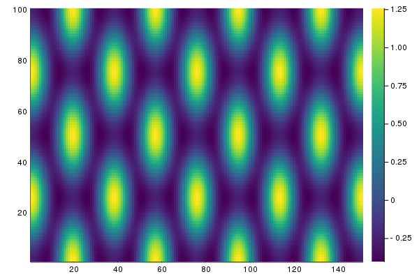
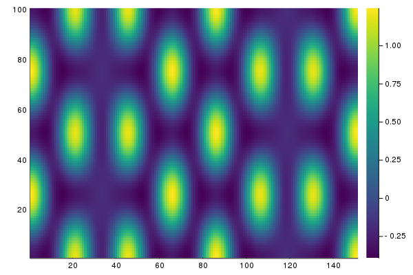

# Snaking in the 2d Swift-Hohenberg equation

```@contents
Pages = ["tutorials2.md"]
Depth = 3
```

We study the following PDE

$$-(I+\Delta)^2 u+l\cdot u +\nu u^2-u^3 = 0$$

with Neumann boundary conditions. This full example is in the file `example/SH2d-fronts.jl`. This example is also treated in the MATLAB package [pde2path](http://www.staff.uni-oldenburg.de/hannes.uecker/pde2path/). We use a Sparse Matrix to express the operator $L_1=(I+\Delta)^2$

```julia
using DiffEqOperators, Setfield, Parameters
using BifurcationKit, LinearAlgebra, Plots, SparseArrays
const BK = BifurcationKit

# helper function to plot solution
heatmapsol(x) = heatmap(reshape(x,Nx,Ny)',color=:viridis)

Nx = 151
Ny = 100
lx = 4*2pi
ly = 2*2pi/sqrt(3)

# we use DiffEqOperators to compute the Laplacian operator
function Laplacian2D(Nx, Ny, lx, ly)
	hx = 2lx/Nx
	hy = 2ly/Ny
	D2x = CenteredDifference(2, 2, hx, Nx)
	D2y = CenteredDifference(2, 2, hy, Ny)
	Qx = Neumann0BC(hx)
	Qy = Neumann0BC(hy)
	
	A = kron(sparse(I, Ny, Ny), sparse(D2x * Qx)[1]) + kron(sparse(D2y * Qy)[1], sparse(I, Nx, Nx))
	return A, D2x
end
```
We also write the functional and its Jacobian which is a Sparse Matrix

```julia
function F_sh(u, p)
	@unpack l, ν, L1 = p
	return -L1 * u .+ (l .* u .+ ν .* u.^2 .- u.^3)
end

function dF_sh(u, p)
	@unpack l, ν, L1 = p
	return -L1 .+ spdiagm(0 => l .+ 2 .* ν .* u .- 3 .* u.^2)
end
```

We first look for hexagonal patterns. This is done with

```julia
X = -lx .+ 2lx/(Nx) * collect(0:Nx-1)
Y = -ly .+ 2ly/(Ny) * collect(0:Ny-1)

# initial guess for hexagons
sol0 = [(cos(x) + cos(x/2) * cos(sqrt(3) * y/2) ) for x in X, y in Y]
	sol0 .= sol0 .- minimum(vec(sol0))
	sol0 ./= maximum(vec(sol0))
	sol0 = sol0 .- 0.25
	sol0 .*= 1.7
	heatmap(sol0',color=:viridis)

# define parameters for the PDE
Δ, _ = Laplacian2D(Nx, Ny, lx, ly)
L1 = (I + Δ)^2
par = (l = -0.1, ν = 1.3, L1 = L1)

# newton corrections of the initial guess
optnewton = NewtonPar(verbose = true, tol = 1e-8, maxIter = 20)
	sol_hexa, _, _ = @time newton(F_sh, dF_sh, vec(sol0), par, optnewton)
	println("--> norm(sol) = ",norm(sol_hexa,Inf64))
	heatmapsol(sol_hexa)
```
which produces the results

```julia
 Newton Iterations 
   Iterations      Func-count      f(x)      Linear-Iterations

        0                1     1.7391e+02         0
        1                2     5.0465e+03         1
        2                3     1.4878e+03         1
        3                4     4.3529e+02         1
        4                5     1.2560e+02         1
        5                6     3.5512e+01         1
        6                7     9.5447e+00         1
        7                8     2.1763e+00         1
        8                9     3.3503e-01         1
        9               10     7.7259e-02         1
       10               11     7.4767e-03         1
       11               12     7.9505e-05         1
       12               13     8.8395e-09         1
  1.480938 seconds (3.55 k allocations: 659.404 MiB)
```

with `sol_hexa` being



## Continuation and bifurcation points

We can now continue this solution as follows. We want to detect bifurcations along the branches. We thus need an eigensolver. However, if we use an iterative eigensolver, like `eig = EigArpack()`, it has trouble computing the eigenvalues. One can see that using 

```julia
# compute the jacobian
J0 = dF_sh(sol_hexa, par)

# compute 10 eigenvalues
eig(J0, 10)
```

The reason is that the jacobian operator is not very well conditioned unlike its inverse. We thus opt for the *shift-invert* method (see [Eigen solvers](@ref) for more information) with shift `0.1`:

```julia
eig = EigArpack(0.1, :LM)
```

If we want to compute the bifurcation points along the branches, we have to tell the solver by setting `detectBifurcation = 2`. However, this won't be very precise and each bifurcation point will be located at best at the step size precision. We can use bisection to locate this points more precisely using the option `detectBifurcation = 3` (see [Detection of bifurcation points](@ref) for more information).

We are now ready to compute the branches:

```julia
optcont = ContinuationPar(dsmin = 0.0001, dsmax = 0.005, ds= -0.001, pMax = 0.00, pMin = -1.0,
	newtonOptions = setproperties(optnewton; tol = 1e-9, maxIter = 15), maxSteps = 125,
	detectBifurcation = 3, nev = 40, detectFold = false, 
	dsminBisection =1e-7, saveSolEveryNsteps = 4)
	optcont = @set optcont.newtonOptions.eigsolver = EigArpack(0.1, :LM)

	br, u1 = @time BK.continuation(F_sh, dF_sh,
		sol_hexa, par, (@lens _.l), optcont;		plot = true, verbosity = 3,
		tangentAlgo = BorderedPred(),
		plotSolution = (x, p; kwargs...) -> (heatmap!(X, Y, reshape(x, Nx, Ny)'; color=:viridis, label="", kwargs...);ylims!(-1,1,subplot=4);xlims!(-.5,.3,subplot=4)),
		printSolution = (x, p) -> norm(x),
		normC = x -> norm(x, Inf))
```

Note that we can get some information about the branch as follows. The `[converged]` indicates if the bisection routine was successful, otherwise it shows `[guess]`. Finally `δ = ( 2,  0)` says that the bifurcation point has been detected by 2 new eigenvalues with zero real part among which zero have non zero imaginary part. A Hopf bifurcation point would thus have `δ = ( 2,  2)` or `δ = ( -2,  2)`.

```julia
julia> br
Branch number of points: 43
Bifurcation points:
-   1,      bp point around p ≈ -0.21554685, step =  21, idx =  22, ind_bif =   1 [converged], δ = ( 1,  0)
-   2,      bp point around p ≈ -0.21504230, step =  22, idx =  23, ind_bif =   3 [converged], δ = ( 2,  0)
-   3,      bp point around p ≈ -0.21095557, step =  24, idx =  25, ind_bif =   5 [converged], δ = ( 2,  0)
-   4,      bp point around p ≈ -0.21001596, step =  25, idx =  26, ind_bif =   6 [converged], δ = ( 1,  0)
-   5,      bp point around p ≈ -0.20684791, step =  26, idx =  27, ind_bif =   8 [converged], δ = ( 2,  0)
-   6,      bp point around p ≈ -0.19986385, step =  28, idx =  29, ind_bif =   9 [converged], δ = ( 1,  0)
-   7,      bp point around p ≈ -0.18895070, step =  30, idx =  31, ind_bif =  10 [converged], δ = ( 1,  0)
-   8,      bp point around p ≈ -0.18103775, step =  32, idx =  33, ind_bif =  11 [converged], δ = ( 1,  0)
-   9,      bp point around p ≈ -0.13841646, step =  37, idx =  38, ind_bif =  10 [converged], δ = (-2,  0)
-  10,      bp point around p ≈ -0.11180884, step =  40, idx =  41, ind_bif =   9 [converged], δ = (-1,  0)
```

We get the following plot during computation:


!!! tip "Tip"
    We don't need to call `newton` first in order to use `continuation`.

## Snaking computed with deflation

We know that there is snaking near the left fold. Let us look for other solutions like fronts. The problem is that if the guess is not precise enough, the newton iterations will converge to the solution with hexagons `sol_hexa`. We appeal to the technique initiated by P. Farrell and use a **deflated problem** (see [`DeflationOperator`](@ref) and [`DeflatedProblem`](@ref) for more information). More precisely, we apply the newton iterations to the following functional $$u\to \frac{F_{sh}(u)}{\Pi_{i=1}^{n_s} \|u-sol_{hexa,i}\|^p + \sigma}$$
which penalizes `sol_hexa`.

```julia
# this define the above penalizing factor with p=2, sigma=1, norm associated to dot
# and the set of sol_{hexa} is of length ns=1
deflationOp = DeflationOperator(2.0,(x,y) -> dot(x,y),1.0,[sol_hexa])
optnewton = @set optnewton.maxIter = 250
outdef, _, flag, _ = @time newton(F_sh, dF_sh,
				0.2vec(sol_hexa) .* vec([exp.(-(x+lx)^2/25) for x in X, y in Y]),
				par, optnewton, deflationOp, normN = x -> norm(x,Inf64))
		heatmapsol(outdef) |> display
		flag && push!(deflationOp, outdef)
```
which gives:


Note that `push!(deflationOp, outdef)` deflates the newly found solution so that by repeating the process we find another one:

```julia
outdef, _, flag, _ = @time newton(F_sh, dF_sh,
				0.2vec(sol_hexa) .* vec([exp.(-(x)^2/25) for x in X, y in Y]),
				par, optnewton, deflationOp, normN = x -> norm(x,Inf64))
		heatmapsol(outdef) |> display
		flag && push!(deflationOp, outdef)
```


Again, repeating this from random guesses, we find several more solutions, like for example




We can now continue the solutions located in `deflationOp.roots`

```julia
br, _ = @time continuation(F_sh, dF_sh,
	deflationOp[2], par, (@lens _.l), optcont;
	plot = true, 
	plotSolution = (x, p; kwargs...) -> (heatmap!(X,Y,reshape(x,Nx,Ny)'; color=:viridis, label="", kwargs...)))
```

and using `plot(br)`, we obtain:


Note that the plot provides the stability of solutions and bifurcation points. Interested readers should consult the associated file `example/SH2d-fronts.jl` in the `example` folder.