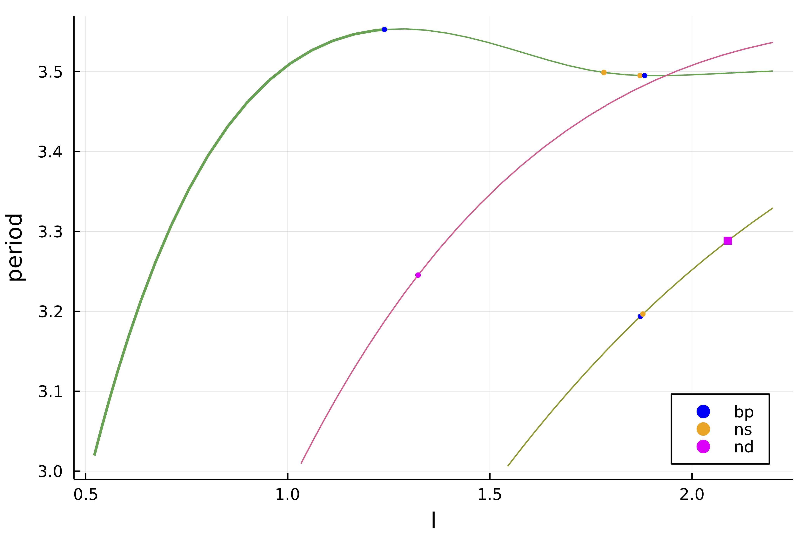
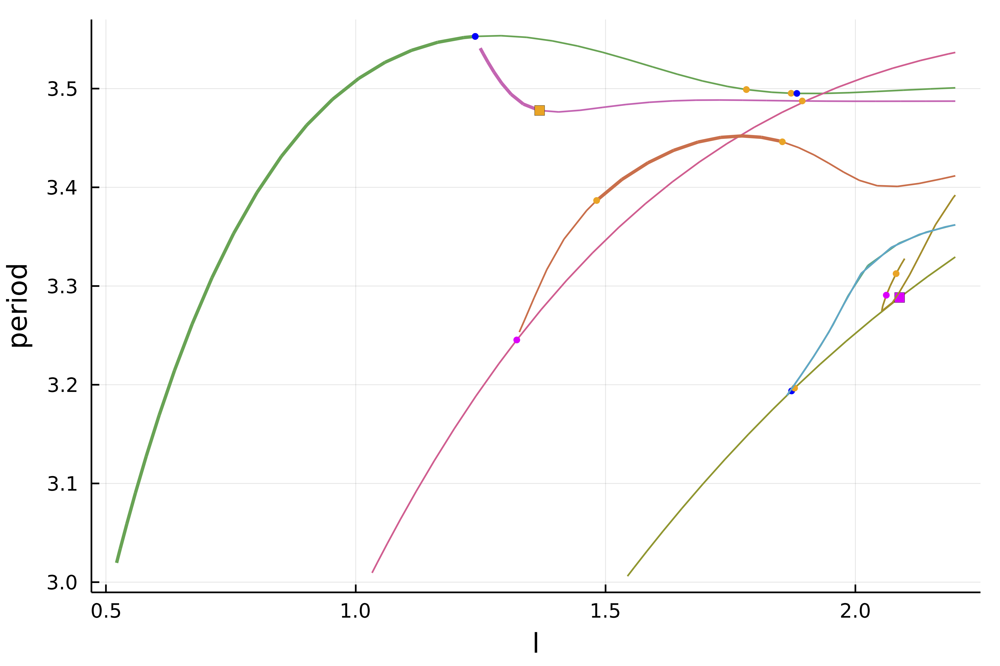
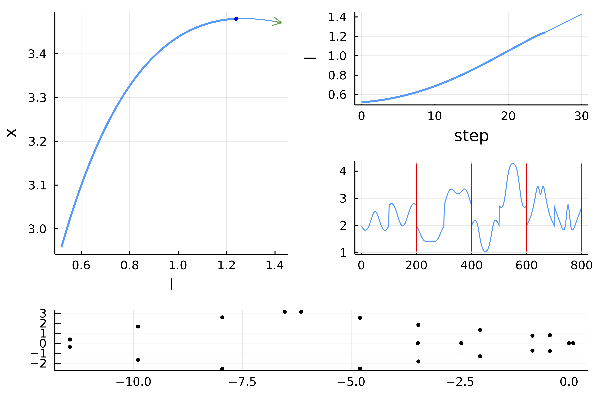
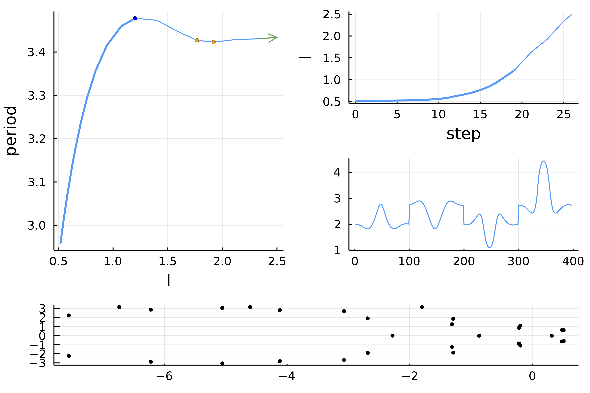

# Brusselator 1d (automatic)

```@contents
Pages = ["tutorials3.md"]
Depth = 3
```

!!! unknown "References"
    This example is taken from **Numerical Bifurcation Analysis of Periodic Solutions of Partial Differential Equations,** Lust, 1997.

We look at the Brusselator in 1d. The equations are as follows

$$\begin{aligned} \frac { \partial X } { \partial t } & = \frac { D _ { 1 } } { l ^ { 2 } } \frac { \partial ^ { 2 } X } { \partial z ^ { 2 } } + X ^ { 2 } Y - ( β + 1 ) X + α \\ \frac { \partial Y } { \partial t } & = \frac { D _ { 2 } } { l ^ { 2 } } \frac { \partial ^ { 2 } Y } { \partial z ^ { 2 } } + β X - X ^ { 2 } Y \end{aligned}$$

with Dirichlet boundary conditions

$$\begin{array} { l } { X ( t , z = 0 ) = X ( t , z = 1 ) = α } \\ { Y ( t , z = 0 ) = Y ( t , z = 1 ) = β / α } \end{array}$$

These equations have been introduced to reproduce an oscillating chemical reaction. There is an obvious equilibrium $(α, β / α)$. Here, we consider bifurcations with respect to the parameter $l$.

We start by writing the PDE

```julia
using Revise
using BifurcationKit, LinearAlgebra, Plots, SparseArrays, Setfield, Parameters
const BK = BifurcationKit

f1(u, v) = u * u * v
norminf = x -> norm(x, Inf)

function Fbru(x, p)
	@unpack α, β, D1, D2, l = p
	f = similar(x)
	n = div(length(x), 2)
	h = 1.0 / n; h2 = h*h
	c1 = D1 / l^2 / h2
	c2 = D2 / l^2 / h2

	u = @view x[1:n]
	v = @view x[n+1:2n]

	# Dirichlet boundary conditions
	f[1]   = c1 * (α      - 2u[1] + u[2] ) + α - (β + 1) * u[1] + f1(u[1], v[1])
	f[end] = c2 * (v[n-1] - 2v[n] + β / α)			 + β * u[n] - f1(u[n], v[n])

	f[n]   = c1 * (u[n-1] - 2u[n] +  α  )  + α - (β + 1) * u[n] + f1(u[n], v[n])
	f[n+1] = c2 * (β / α  - 2v[1] + v[2])			 + β * u[1] - f1(u[1], v[1])

	for i=2:n-1
		  f[i] = c1 * (u[i-1] - 2u[i] + u[i+1]) + α - (β + 1) * u[i] + f1(u[i], v[i])
		f[n+i] = c2 * (v[i-1] - 2v[i] + v[i+1])			  + β * u[i] - f1(u[i], v[i])
	end
	return f
end
```

For computing periodic orbits, we will need a Sparse representation of the Jacobian:

```julia
function Jbru_sp(x, p)
	@unpack α, β, D1, D2, l = p
	# compute the Jacobian using a sparse representation
	n = div(length(x), 2)
	h = 1.0 / n; h2 = h*h

	c1 = D1 / p.l^2 / h2
	c2 = D2 / p.l^2 / h2

	u = @view x[1:n]
	v = @view x[n+1:2n]

	diag   = zeros(eltype(x), 2n)
	diagp1 = zeros(eltype(x), 2n-1)
	diagm1 = zeros(eltype(x), 2n-1)

	diagpn = zeros(eltype(x), n)
	diagmn = zeros(eltype(x), n)

	@. diagmn = β - 2 * u * v
	@. diagm1[1:n-1] = c1
	@. diagm1[n+1:end] = c2

	@. diag[1:n]    = -2c1 - (β + 1) + 2 * u * v
	@. diag[n+1:2n] = -2c2 - u * u

	@. diagp1[1:n-1] = c1
	@. diagp1[n+1:end] = c2

	@. diagpn = u * u
	return spdiagm(0 => diag, 1 => diagp1, -1 => diagm1, n => diagpn, -n => diagmn)
end
```

!!! tip "Tip"
    We could have used `DiffEqOperators.jl` like for the Swift-Hohenberg tutorial.

We shall now compute the equilibria and their stability.

```julia
n = 300

# parameters of the Brusselator model and guess for the stationary solution
par_bru = (α = 2., β = 5.45, D1 = 0.008, D2 = 0.004, l = 0.3)
sol0 = vcat(par_bru.α * ones(n), par_bru.β/par_bru.α * ones(n))
```

For the eigensolver, we use a Shift-Invert algorithm (see [Eigen solvers (Eig)](@ref))

```julia
eigls = EigArpack(1.1, :LM)
```

We continue the trivial equilibrium to find the Hopf points

```julia
opt_newton = NewtonPar(eigsolver = eigls, verbose = false)
opts_br_eq = ContinuationPar(dsmin = 0.001, dsmax = 0.01, ds = 0.001, 
	pMax = 1.9, detectBifurcation = 3, nev = 21, plotEveryStep = 50, 
	newtonOptions = NewtonPar(eigsolver = eigls, tol = 1e-9), maxSteps = 1060,
	# specific options for precise localization of Hopf points
	nInversion = 6)

	br, = @time continuation(Fbru, Jbru_sp, sol0, par_bru, (@lens _.l),
		opts_br_eq, verbosity = 0,
		plot = true,
		printSolution = (x,p) -> x[n÷2], normC = norminf)
```

We obtain the following bifurcation diagram with 3 Hopf bifurcation points


## Normal form computation

We can compute the normal form of the Hopf points as follows

```julia
using ForwardDiff
function D(f, x, p, dx)
	return ForwardDiff.derivative(t->f(x .+ t .* dx, p), 0.)
end
d1Fbru(x,p,dx1) = D((z, p0) -> Fbru(z, p0), x, p, dx1)
d2Fbru(x,p,dx1,dx2) = D((z, p0) -> d1Fbru(z, p0, dx1), x, p, dx2)
d3Fbru(x,p,dx1,dx2,dx3) = D((z, p0) -> d2Fbru(z, p0, dx1, dx2), x, p, dx3)

# we group the differentials together
jet  = (Fbru, Jbru_sp, d2Fbru, d3Fbru)

hopfpt = BK.computeNormalForm(jet..., br, 1)
```
and you should get

```julia
julia> hopfpt
SuperCritical - Hopf bifurcation point at p ≈ 0.5113310149554013.
Period of the periodic orbit ≈ 2.9367552006841753.
Normal form: (a = 0.8799941318427783 + 0.5689746667563035im, b = -0.0015608102901479592 + 0.0015634810970084371im)
```

## Continuation of Hopf points

We use the bifurcation points guesses located in `br.bifpoint` to turn them into precise bifurcation points. For the second one, we have

```julia
# index of the Hopf point in br.bifpoint
ind_hopf = 2
hopfpoint, _, flag = @time newton(Fbru, Jbru_sp,
	br, ind_hopf, par_bru, (@lens _.l); normN = norminf)
flag && printstyled(color=:red, "--> We found a Hopf Point at l = ", hopfpoint.p[1], ", ω = ", hopfpoint.p[2], ", from l = ", br.bifpoint[ind_hopf].param, "\n")
```

which produces

```julia
--> We found a Hopf Point at l = 1.0239851696548035, ω = 2.1395092895339842, from l = 1.0353910524340078
```

We now perform a Hopf continuation with respect to the parameters `l, β`

!!! tip "Tip"
    You don't need to call `newtonHopf` first in order to use `continuationHopf`.

```julia
br_hopf, = @time continuation(Fbru, Jbru_sp,
	br, ind_hopf, par_bru, (@lens _.l), (@lens _.β),
	ContinuationPar(dsmin = 0.001, dsmax = 0.05, ds= 0.01, pMax = 6.5, pMin = 0.0, newtonOptions = opt_newton), verbosity = 2, normC = norminf)
```

which gives using `plot(br_hopf, xlabel="beta", ylabel = "l")`


## Computation of the branch of periodic orbits (Finite differences)

We now compute the bifurcated branches of periodic solutions from the Hopf points using [Periodic orbits based on finite differences](@ref). One has just to pass a [`PeriodicOrbitTrapProblem`](@ref).

We start by providing a linear solver and some options for the continuation to work

```julia
# automatic branch switching from Hopf point
opt_po = NewtonPar(tol = 1e-10, verbose = true, maxIter = 15)
opts_po_cont = ContinuationPar(dsmin = 0.001, dsmax = 0.04, ds = 0.03, pMax = 2.2, maxSteps = 200, newtonOptions = opt_po, saveSolEveryStep = 2,
	plotEveryStep = 1, nev = 11, precisionStability = 1e-6,
	detectBifurcation = 3, dsminBisection = 1e-6, maxBisectionSteps = 15, tolBisectionEigenvalue = 0.)
```

```julia
# number of time slices for the periodic orbit
M = 51
probFD = PeriodicOrbitTrapProblem(M = M)
br_po, = continuation(
	# arguments for branch switching from the first 
	# Hopf bifurcation point
	jet..., br, 1,
	# arguments for continuation
	opts_po_cont, probFD;
	# OPTIONAL parameters
	# we want to jump on the new branch at phopf + δp
	# ampfactor is a factor to increase the amplitude of the guess
	δp = 0.01, ampfactor = 1,
	# specific method for solving linear system
	# of Periodic orbits with trapeze method
	# You could use the default one :FullLU (slower here)
	linearPO = :FullSparseInplace,
	# regular options for continuation
	verbosity = 3,	plot = true, 
	plotSolution = (x, p; kwargs...) -> heatmap!(reshape(x[1:end-1], 2*n, M)'; ylabel="time", color=:viridis, kwargs...), 
	normC = norminf)
```


Using the above call, it is very easy to find the first branches:



We note that there are several branch points (blue points) on the above diagram. This means that there are additional branches in the neighborhood of these points. We now turn to automatic branch switching on these branches. This functionality, as we shall see, is only provided for [`PeriodicOrbitTrapProblem`](@ref).

Let's say we want to branch from the first branch point of the first curve pink branch. The syntax is very similar to the previous one:

```julia
br_po2, = BK.continuationPOTrapBPFromPO(
	# arguments for branch switching
	br_po, 1,
	# arguments for continuation
	opts_po_cont; linearPO = :FullSparseInplace,
	ampfactor = 1., δp = 0.01,	
	verbosity = 3,	plot = true,
	plotSolution = (x, p; kwargs...) -> heatmap!(reshape(x[1:end-1], 2*n, M)'; ylabel="time", color=:viridis, kwargs...),
	normC = norminf)
```

It is now straightforward to get the full following diagram



## Computation of the branch of periodic orbits (Standard Shooting)

> Note that what follows is not really optimized on the `DifferentialEquations.jl` side. Indeed, we do not use automatic differentiation, we do not pass the sparsity pattern, ...

We now turn to a different method based on the flow of the Brusselator. To compute this flow (time stepper), we need to be able to solve the differential equation (actually a PDE) associated to the vector field `Fbru`. We will show how to do this with an implicit method `Rodas4P` from `DifferentialEquations.jl`. Note that the user can pass its own time stepper but for convenience, we use the ones in `DifferentialEquations.jl`. More information regarding the shooting method is contained in [Periodic orbits based on the shooting method](@ref). To define the flow, it is better to have an **inplace** version of the vector field:

```julia
function Fbru!(f, x, p)
	@unpack α, β, D1, D2, l = p
	n = div(length(x), 2)
	h = 1.0 / n; h2 = h*h
	c1 = D1 / l^2 / h2
	c2 = D2 / l^2 / h2
	
	u = @view x[1:n]
	v = @view x[n+1:2n]
	
	# Dirichlet boundary conditions
	f[1]   = c1 * (α	  - 2u[1] + u[2] ) + α - (β + 1) * u[1] + f1(u[1], v[1])
	f[end] = c2 * (v[n-1] - 2v[n] + β / α)			 + β * u[n] - f1(u[n], v[n])
	
	f[n]   = c1 * (u[n-1] - 2u[n] +  α   ) + α - (β + 1) * u[n] + f1(u[n], v[n])
	f[n+1] = c2 * (β / α  - 2v[1] + v[2])			 + β * u[1] - f1(u[1], v[1])
	
	for i=2:n-1
		  f[i] = c1 * (u[i-1] - 2u[i] + u[i+1]) + α - (β + 1) * u[i] + f1(u[i], v[i])
		f[n+i] = c2 * (v[i-1] - 2v[i] + v[i+1])			  + β * u[i] - f1(u[i], v[i])
	end
	return f
end

Fbru(x, p) = Fbru!(similar(x), x, p)
```

We then recompute the locus of the Hopf bifurcation points using the same method as above.

```julia
n = 100

# different parameters to define the Brusselator model and guess for the stationary solution
par_bru = (α = 2., β = 5.45, D1 = 0.008, D2 = 0.004, l = 0.3)
sol0 = vcat(par_bru.α * ones(n), par_bru.β/par_bru.α * ones(n))

eigls = EigArpack(1.1, :LM)
opts_br_eq = ContinuationPar(dsmin = 0.001, dsmax = 0.00615, ds = 0.0061, pMax = 1.9, 
	detectBifurcation = 3, nev = 21, plotEveryStep = 50, 
	newtonOptions = NewtonPar(eigsolver = eigls, tol = 1e-9), maxSteps = 200)

br, = @time continuation(Fbru, Jbru_sp,
	sol0, par_bru, (@lens _.l), opts_br_eq, verbosity = 0,
	plot = false,
	printSolution = (x, p)->x[n÷2], normC = norminf)
```

We need to build a problem which encodes the Shooting functional. This done as follows where we first create the time stepper:

```julia
using DifferentialEquations, DiffEqOperators

FOde(f, x, p, t) = Fbru!(f, x, p)

u0 = sol0 .+ 0.01 .* rand(2n)

# this is the ODE time stepper when used with `solve`
probsundials = ODEProblem(FOde, u0, (0., 1000.), par_bru;
	atol = 1e-10, rtol = 1e-8, jac = (J,u,p,t) -> J .= Jbru_sp(u,p), jac_prototype = Jbru_sp(u0, par_bru))
```

!!! tip "Performance"
    You can really speed this up by using the improved `ODEProblem`
    ```julia
    using SparseDiffTools, SparseArrays, DiffEqDiffTools
    jac_prototype = Jbru_sp(ones(2n), par_bru)
    jac_prototype.nzval .= ones(length(jac_prototype.nzval))
    _colors = matrix_colors(jac_prototype)
    vf = ODEFunction(FOde; jac_prototype = jac_prototype, colorvec = _colors)
    probsundials = ODEProblem(vf,  u0, (0.0, 520.), par_bru) # gives 0.22s
    ```

We also compute with automatic differentiation, the differentials of the vector field. This is is needed for branch switching as it is based on the computation of the Hopf normal form:

```julia
using ForwardDiff
function D(f, x, p, dx)
	return ForwardDiff.derivative(t->f(x .+ t .* dx, p), 0.)
end
d1Fbru(x,p,dx1) = D((z, p0) -> Fbru(z, p0), x, p, dx1)
d2Fbru(x,p,dx1,dx2) = D((z, p0) -> d1Fbru(z, p0, dx1), x, p, dx2)
d3Fbru(x,p,dx1,dx2,dx3) = D((z, p0) -> d2Fbru(z, p0, dx1, dx2), x, p, dx3)

jet  = (Fbru, Jbru_sp, d2Fbru, d3Fbru)
```

We are now ready to call the automatic branch switching. Note how similar it is to the previous section based on finite differences. This case is more deeply studied in the tutorial [Brusselator 1d (advanced user)](@ref). We use a parallel Shooting.

```julia
# linear solvers
ls = GMRESIterativeSolvers(tol = 1e-7, maxiter = 100, verbose = false)
eig = EigKrylovKit(tol= 1e-12, x₀ = rand(2n), verbose = 0, dim = 40)
# newton parameters
optn_po = NewtonPar(verbose = true, tol = 1e-7,  maxIter = 25, linsolver = ls, eigsolver = eig)
# continuation parameters
opts_po_cont = ContinuationPar(dsmax = 0.03, ds= 0.01, pMax = 2.5, maxSteps = 10,
	newtonOptions = optn_po, nev = 15, precisionStability = 1e-3,
	detectBifurcation = 0, plotEveryStep = 2)

Mt = 2 # number of shooting sections
br_po, = continuation(
	jet..., br, 1,
	# arguments for continuation
	opts_po_cont,
	# this is where we tell that we want Parallel Standard Shooting
	ShootingProblem(Mt, par_bru, probsundials, Rodas4P(), abstol = 1e-10, retol = 1e-8, parallel = true);
	ampfactor = 1.0, δp = 0.0075,
	# the next option is not necessary
	# it speeds up the newton iterations
	# by combining the linear solves of the bordered linear system
	linearAlgo = MatrixFreeBLS(@set ls.N = 2+2n*Mt),
	verbosity = 3,	plot = true,
	plotSolution = (x, p; kwargs...) -> BK.plotPeriodicShooting!(x[1:end-1], Mt; kwargs...),
	normC = norminf)
```

and you should see 



## Computation of the branch of periodic orbits (Poincaré Shooting)

We now turn to another Shooting method, namely the Poincaré one. We can provide this method thanks to the unique functionalities of `DifferentialEquations.jl`. More information is provided at [`PoincareShootingProblem`](@ref) and [Periodic orbits based on the shooting method](@ref) but basically, it is a shooting method between Poincaré sections $\Sigma_i$ (along the orbit) defined by hyperplanes. As a consequence, the dimension of the unknowns is $M_{sh}\cdot(N-1)$ where $N$ is the dimension of the phase space. Indeed, each time slice lives in an hyperplane $\Sigma_i$. Additionally, the period $T$ is not an unknown of the method but rather a by-product. However, the method requires the time stepper to find when the flow hits an hyperplane $\Sigma_i$, something called **event detection**.

We show how to use this method, the code is very similar to the case of the Parallel Standard Shooting:

```julia
# linear solvers
ls = GMRESIterativeSolvers(tol = 1e-8, maxiter = 100)
eig = EigKrylovKit(tol= 1e-12, x₀ = rand(2n-1), verbose = 0, dim = 50)
# newton parameters
optn_po = NewtonPar(verbose = true, tol = 1e-7,  maxIter = 25, linsolver = ls, eigsolver = eig)
# continuation parameters
opts_po_cont = ContinuationPar(dsmax = 0.03, ds= 0.005, pMax = 2.5, maxSteps = 100, newtonOptions = optn_po, nev = 10, precisionStability = 1e-5, detectBifurcation = 0, plotEveryStep = 2)

# number of time slices
Mt = 1
br_po, = continuation(
	jet..., br, 1,
	# arguments for continuation
	opts_po_cont, PoincareShootingProblem(Mt, par_bru, probsundials, Rodas4P(); abstol = 1e-10, retol = 1e-8, parallel = true);
	# the next option is not necessary
	# it speeds up the newton iterations
	# by combining the linear solves of the bordered linear system
	linearAlgo = MatrixFreeBLS(@set ls.N = (2n-1)*Mt+1),
	ampfactor = 1.0, δp = 0.005,
	verbosity = 3,	plot = true,
	updateSectionEveryStep = 1,
	plotSolution = (x, p; kwargs...) -> BK.plotPeriodicShooting!(x[1:end-1], Mt; kwargs...),
	normC = norminf)
```	

and you should see:

